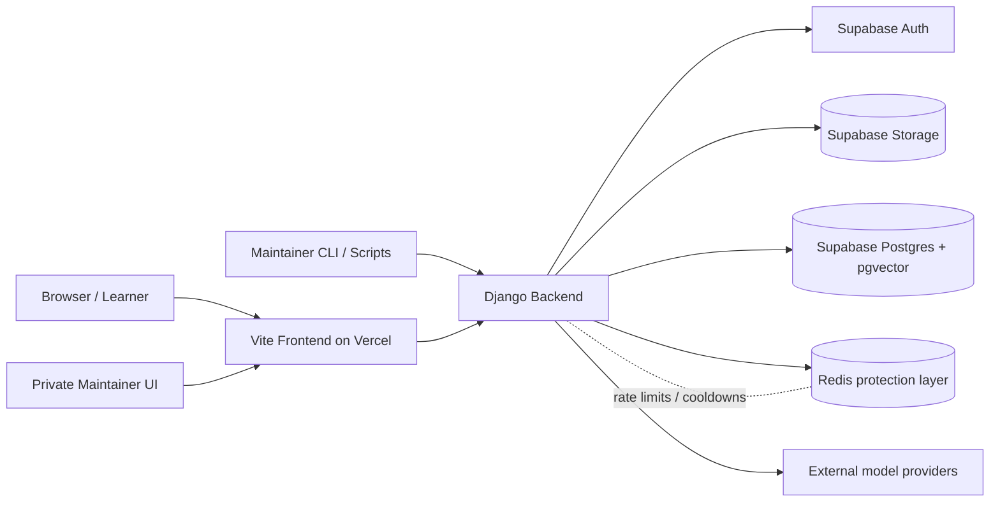

---
stepsCompleted:
  - 1
  - 2
  - 3
  - 4
  - 5
  - 6
  - 7
  - 8
inputDocuments:
  - _bmad-output/planning-artifacts/product-brief-Global-Governance.md
  - _bmad-output/planning-artifacts/prd.md
  - _bmad-output/planning-artifacts/ux-design-specification.md
workflowType: 'architecture'
project_name: 'Global-Governance'
user_name: 'Nakko'
date: '2026-04-23'
lastEdited: '2026-05-02'
lastStep: 8
status: 'complete'
completedAt: '2026-04-23'
editHistory:
  - date: '2026-05-02'
    summary: 'Rebaselined the architecture for the approved Django chatbot-backend pivot, private maintainer authentication boundary, and source-stewardship admin operations.'
  - date: '2026-05-02'
    summary: 'Patched contradictions called out in adversarial review, including transition-state clarity, API contract depth, test ownership, and readiness caveats.'
---

# Architecture Decision Document

_This document builds collaboratively through step-by-step discovery. Sections are appended as we work through each architectural decision together._

## Project Context Analysis

### Requirements Overview

**Functional Requirements:**
The project defines 46 functional requirements across eight architectural capability areas: learning experience and content delivery, navigation and guided exploration, interactive learning modules, comprehension support and adaptive depth, grounded chatbot assistance, source credibility and academic trust, maintainer and content stewardship, and presentation quality with future expansion hooks.

Architecturally, this means the system needs more than a static content site. It needs a structured narrative content model, section-aware navigation and progress tracking, custom interactive module surfaces for the UN Command Center and West Philippine Sea dossier, a bounded chatbot pipeline backed by approved materials, visible citation and reference support, and maintainer workflows for source preparation, validation, private source stewardship, and demo-readiness checks.

The requirements also imply a split between stable academic content, rich client-side presentation logic, and chatbot-specific retrieval and response orchestration. Post-MVP hooks such as Student / Expert mode and a future simulator should be supported without forcing the MVP to carry their full complexity on day one.

**Non-Functional Requirements:**
The project defines 25 non-functional requirements across performance, security, reliability, accessibility, and integration.

The most architecture-shaping NFRs are:
- initial usable state within 3 seconds on the reference demo device
- primary interactions responding within 1 second at the 95th percentile
- chatbot loading feedback within 0.5 seconds and usable answer or fallback within 8 seconds
- no learner authentication requirement, limited maintainer-only private authentication, and minimal persistent personal data handling
- encrypted transport and secrets kept out of source-controlled code
- approved-source-only chatbot grounding with strong refusal behavior for off-topic prompts
- graceful degradation when premium or chatbot-specific features fail
- WCAG 2.1 AA-aligned accessibility, keyboard operability, and reduced-motion behavior
- reproducible local setup and deterministic ingestion behavior for approved-source materials

These NFRs strongly favor an architecture that separates critical learning flow from optional premium layers, treats chatbot trustworthiness as a system-level concern, and makes validation tooling part of the architecture rather than an afterthought.

**Scale & Complexity:**
This is a high-complexity project for a single-page educational web application.

- Primary domain: full-stack web application
- Complexity level: high
- Estimated architectural components: 9 core components

The complexity does not come from enterprise data volume, multi-tenancy, or real-time collaboration. It comes from the combination of premium scrollytelling UX, interactive educational modules, academic trust requirements, source-grounded chatbot behavior, and presentation-critical reliability. The architecture therefore needs to stay deliberately lean while still creating clear boundaries between content, UI orchestration, retrieval, and validation.

### Technical Constraints & Dependencies

Known constraints and dependencies from the product documents include:
- The experience is a single-page web application optimized for guided scrollytelling and selective exploration.
- Motion is the default UI animation layer, Lenis handles scroll feel, and GSAP is restricted to rare isolated showcase scenes.
- The UX expects responsive behavior across 360 px, 480 px, 768 px, 1024 px, and 1280 px breakpoints.
- The design system direction assumes a themeable component foundation with accessible primitives and custom flagship composites.
- The chatbot must remain bounded to approved materials, expose source-aware behavior, and fail safely when support is weak.
- The MVP should avoid learner accounts, LMS integration, and general-purpose assistant behavior while allowing tightly scoped private maintainer authentication when required for source stewardship.
- Content and approved sources must be maintainable and updatable without restructuring the whole experience.
- The project must support local chatbot setup, ingestion, and validation workflows from a clean clone.

### Cross-Cutting Concerns Identified

The main cross-cutting concerns that will affect multiple architectural components are:
- source governance and traceability across page content, chatbot answers, and references
- accessibility, including keyboard support, focus visibility, semantic structure, and reduced-motion behavior
- performance budgeting, especially for hero media, heavy interactions, optional showcase scenes, and deferred loading
- graceful degradation so the learning flow remains usable if premium visuals or chatbot capabilities are unavailable
- orientation and state management across a long single-page narrative with embedded interactive modules
- validation and demo-readiness testing across content integrity, grounding accuracy, responsiveness, and device coverage

## Starter Template Evaluation

### Primary Technology Domain

Full-stack web application with a frontend-first SPA foundation, based on project requirements analysis.

The product is primarily a premium single-page React experience, but it also needs a bounded chatbot pipeline with retrieval, source governance, and local validation workflows. That makes it more than a purely static frontend, but it still does not justify a heavy full-stack framework as the default starting point.

### Starter Options Considered

**1. Official Vite React + TypeScript starter**
This is the lightest and most direct foundation for the documented architecture. It provides a fast React development environment, a simple SPA-friendly structure, and keeps architectural control in our hands. However, it does not include Tailwind or shadcn/ui setup by default, so more baseline configuration work is still needed immediately after scaffolding.

**2. Official shadcn/ui Vite scaffold**
This is the strongest fit for the current project documents. It keeps the Vite + React direction, aligns with the UX spec's accessible component foundation, and reduces setup friction for Tailwind-compatible design-system work. It also fits the project's SPA-first structure better than a server-first framework and matches the documented preference for custom flagship sections built on top of accessible primitives.

**3. Official Next.js starter**
This is a viable alternative because Next.js 16 can start as a static site or SPA and later grow into server-backed features. It also provides strong defaults out of the box. However, it introduces an App Router and framework conventions that are not reflected in the current implementation guides, and it would shift the architecture away from the clearly documented React + Vite plan already established across the project materials.

### Selected Starter: shadcn/ui Vite scaffold

**Rationale for Selection:**
This starter best matches the project's documented technical direction: React, Vite, TypeScript, Tailwind-oriented styling, and shadcn/ui as the accessible primitive layer. It preserves the intended SPA architecture, supports Motion/Lenis layering cleanly, and keeps the chatbot backend concerns decoupled from the main presentation shell. It also minimizes avoidable setup churn compared with starting from plain Vite and manually assembling the same baseline from scratch.

**Initialization Command:**

```bash
pnpm dlx shadcn@latest init -t vite
```

**Architectural Decisions Provided by Starter:**

**Language & Runtime:**
A React application scaffolded on Vite with modern TypeScript-friendly conventions and current Vite-compatible Node requirements.

**Styling Solution:**
A Vite-compatible shadcn/ui setup path aligned with Tailwind-based styling and the `@/*` alias convention used by the component system.

**Build Tooling:**
Vite-based local development with fast startup, HMR, and optimized production build tooling. Current official Vite docs reflect the Vite 8 generation of the toolchain.

**Testing Framework:**
No full testing stack is imposed by default. This is a positive fit for the project because testing strategy can be chosen intentionally around the final architecture instead of being inherited accidentally from a generic boilerplate.

**Code Organization:**
A lean frontend app structure suited to a section-based SPA, with room to add custom feature modules for content, motion, chatbot UI, retrieval integration, and validation workflows without fighting framework-imposed routing or server boundaries.

**Development Experience:**
Fast local iteration, simple component composition, straightforward integration of Motion, Lenis, and selective React Three Fiber, plus shadcn CLI support for adding accessible primitives as needed.

**Note:** Project initialization using this command should be the first implementation story.

## Core Architectural Decisions

### Decision Priority Analysis

**Critical Decisions (Block Implementation):**
- Use a split-content architecture:
  - primary website narrative content lives in repo-managed typed content modules
  - approved chatbot corpus lives in Supabase Storage and Supabase Postgres with pgvector
- Use Django as the backend/API orchestration layer for chat, retrieval, topic guard, safety guard, ingestion, validation, citation packaging, and admin-protected operations
- Treat the existing Supabase Edge Function chat and ingestion path as transitional implementation residue, not the target end-state architecture:
  - existing functions may remain temporarily during migration and parity verification
  - no new feature investment should deepen the Edge Function path unless explicitly required as a short-lived bridge
  - the architecture target is a Django-owned public chat and admin orchestration boundary
- Use no end-user authentication in the MVP
- Allow private maintainer authentication through Supabase Auth while keeping learner use login-free
- Keep maintainer operations available through both reproducible local workflows and authenticated admin operations
- Deploy the Vite frontend on Vercel as the presentation shell

**Important Decisions (Shape Architecture):**
- Use schema validation at all API and ingestion boundaries
- Use version-controlled SQL migrations through the Supabase CLI
- Use REST-style JSON endpoints rather than GraphQL
- Use Redis in the MVP only as a shared protection layer for public-chat rate limiting, abuse counters, and cooldown state
- Use local React state plus thin context providers instead of introducing a global state library in the MVP
- Use aggressive lazy loading for chat, heavy media, and optional 3D/showcase modules

**Deferred Decisions (Post-MVP):**
- Student / Expert mode persistence across sessions
- broader distributed caching beyond Redis-backed protection and narrow support-endpoint caching
- simulator-specific state architecture
- end-user analytics beyond lightweight privacy-conscious usage telemetry

### Data Architecture

**Primary data model:**
Use two distinct data domains.

1. **Presentation content domain**
- Store core educational content, section structure, references metadata, navigation labels, and UI-facing summaries inside the app repository.
- Represent these with typed content modules so the main site stays deterministic, reviewable, and easy to rehearse offline.

2. **Grounded chatbot knowledge domain**
- Store raw approved source files in Supabase Storage.
- Store normalized chunks, metadata, and embeddings in Supabase Postgres with pgvector.
- Store admin-facing source metadata, ingestion jobs, validation runs, and audit records in Supabase Postgres under Django-controlled server access.
- Model the stewardship layer explicitly instead of implying it emerges automatically from retrieval tables:
  - `sources`
  - `source_versions`
  - `ingestion_jobs`
  - `validation_runs`
  - `audit_logs`
- Keep retrieval data separate from the main rendered page content so chatbot ingestion and site copy can evolve without forcing the entire site architecture to change.

**Data validation strategy:**
- Use TypeScript types for internal app structures.
- Use runtime schema validation at external boundaries, especially:
  - ingestion payloads
  - chat request/response contracts
  - retrieved citation payloads
  - source metadata records

**Migration approach:**
- Use Supabase SQL migrations in version control as the source of truth.
- Create and test migrations locally with the Supabase CLI, then push to remote environments through reviewed migration files.
- Generate typed database contracts from the database schema when needed for frontend-safe consumption.
- Treat the current ingestion-oriented migration set as incomplete for the Django rebaseline until stewardship tables, validation records, and audit history are added.

**Caching strategy:**
- Introduce Redis in the MVP only for shared public-chat protection concerns:
  - rate limiting
  - abuse counters
  - cooldown flags
  - short-lived deduplication or support-endpoint state when clearly justified
- Rely on:
  - precomputed embeddings instead of live document parsing
  - CDN/static asset caching for the frontend
  - selective browser caching for static content assets
  - optional short-lived Redis or server-side caching only for low-risk support endpoints such as prompt suggestions
- Do not use Redis as the source of truth for approved documents, chunks, embeddings, or citations.
- Do not cache grounded chat answers broadly in the MVP because response trust and citation integrity matter more than cache hit rate.

### Authentication & Security

**Authentication method:**
- No learner authentication in the MVP.
- No public maintainer dashboard linked from the learner-facing experience.
- Allow private maintainer authentication through Supabase Auth for source stewardship and admin-protected operations.
- Maintain local scripts and CLI workflows as a reproducible fallback path for content and backend operations.
- If a maintainer UI is introduced, it must be a private route family or separate private frontend surface that is never discoverable from normal learner navigation.

**Authorization pattern:**
- Keep public read access limited to what the frontend must render.
- Route authenticated admin requests through Django, which verifies Supabase Auth tokens, applies maintainer authorization checks, and then performs approved-source writes, ingestion, retrieval administration, and validation actions through server-side credentials.
- Enable Row Level Security for Supabase tables and design policies so public clients cannot mutate chatbot source data.

**Secret handling:**
- Store service credentials only in server-side environments and platform secrets.
- Never expose service-role credentials to the browser.
- Separate public browser keys from private Django orchestration secrets, Supabase service-role credentials, and any model-provider keys.

**API security strategy:**
- Chat, ingestion, validation, and admin logic run server-side through Django.
- Apply input validation, topic gating, and safe fallback handling before any answer is returned.
- Use Redis-backed rate limiting and abuse controls at the API boundary, with stricter controls for admin and ingestion endpoints than for learner chat.
- Keep Redis-owned operational state short-lived and privacy-conscious, with no learner-account requirement and no long-term personal profile storage.
- Treat source citation resolution as a security and trust requirement, not just a UX feature.
- Run Redis as a server-side protection service only, accessed from Django and never from the browser.
- Use a disposable local Redis instance or mocked adapter in development so frontend and content workflows remain runnable even when the protection layer is offline.

### API & Communication Patterns

**API style:**
- Use REST-style HTTP JSON endpoints.
- Keep the API surface small and explicit.

**Planned endpoint families:**
- `POST /api/chat`
- `GET /api/chat/suggestions`
- `GET /api/admin/me`
- `GET /api/admin/sources`
- `POST /api/admin/sources/upload`
- `PATCH /api/admin/sources/{sourceId}`
- `POST /api/admin/sources/{sourceId}/ingest`
- `GET /api/admin/ingestion-jobs`
- `POST /api/admin/validation-runs`
- `GET /api/admin/audit-logs`

These routes are served through Django, which acts as the single orchestration boundary between the frontend and Supabase-backed data services.

**Chat request lifecycle contract:**
- The MVP chat path is non-streaming by default unless implementation proves streaming is required to meet the responsiveness target.
- Every chat request should carry or receive:
  - `requestId`
  - `sessionId`
  - `messageId`
  - `state`
  - `citations`
- The backend must support:
  - deterministic timeout handling
  - safe retries for idempotent support endpoints
  - client-visible cancellation or abandonment semantics even if server work completes after the user closes the panel
- Loading feedback should appear immediately in the UI, while the backend returns either a grounded answer, refusal, weak-support response, or typed infrastructure failure within the documented SLA target.

**Error handling standard:**
- Use a consistent error envelope with:
  - machine-readable code
  - short user-safe message
  - optional debug detail only in non-production contexts
- Distinguish clearly between:
  - off-topic refusal
  - weak-support fallback
  - validation failure
  - transient infrastructure failure

**Service communication:**
- Frontend talks only to approved backend endpoints and never directly to privileged retrieval operations.
- Django coordinates with Supabase Auth, Storage, Postgres, Redis, and external model providers.
- Keep model orchestration behind one backend boundary so the frontend stays presentation-focused.

### Frontend Architecture

**State management approach:**
- Use local component state by default.
- Use thin React context only for cross-cutting app concerns such as:
  - active section/navigation state
  - reduced-motion and display preferences
  - chat panel open/close state
  - future Student / Expert mode toggle
- Do not introduce Redux or another heavyweight global state library in the MVP.
- Keep MVP chat transcript continuity session-local to the chat surface unless a later story explicitly expands the backend contract for persistence or conversational memory.

**Component architecture:**
- Organize the frontend around feature boundaries:
  - layout
  - sections
  - flagship modules
  - chat
  - references
  - shared UI primitives
- Keep shadcn/ui primitives in the shared UI layer and build custom composites for:
  - Hero
  - UN Command Center
  - West Philippine Sea Dossier
  - Source-Aware Chat Panel and chat transcript surfaces
- If a private maintainer UI is added, keep it in an explicitly private feature boundary rather than mixing it into learner-facing story sections.

**Routing strategy:**
- Use a single-page anchor-navigation architecture in the MVP.
- Avoid React Router unless the project later expands into genuinely separate page flows.

**Performance optimization:**
- Lazy-load:
  - React Three Fiber hero assets
  - chatbot panel logic
  - optional showcase animation code
  - any module that is not needed for first render
- Keep critical-above-the-fold content lightweight and readable before premium effects initialize.
- Respect reduced-motion preferences from the start.
- Provide explicit fallback states for premium surfaces:
  - hero scene fallback
  - module-level fallback or error boundary for UN Command Center
  - module-level fallback or error boundary for WPS dossier
  - typed unavailable state for chat-dependent UI

**Bundle optimization:**
- Separate heavy feature code into isolated chunks.
- Keep GSAP out of the default path unless a specific sequence requires it.
- Keep the main narrative readable even if premium feature chunks are delayed or fail.

### Infrastructure & Deployment

**Hosting strategy:**
- Deploy the Vite frontend to Vercel.
- Use Vercel for static asset delivery, preview deployments, and frontend environment management.
- Deploy Django as a separate backend service suitable for authenticated APIs, background-capable orchestration, and long-running app processes.
- Use Supabase as the backend platform for Auth, Storage, Postgres, and pgvector.

**CI/CD approach:**
- Use Git-based preview deployments for the frontend.
- Treat Django deployment and database migrations as reviewed release actions, not ad hoc dashboard edits.
- Keep infrastructure simple and close to the repo so demo-readiness remains reproducible.

**Environment configuration:**
- Separate:
  - browser-safe public variables
  - frontend build-time variables
  - server-only secrets
  - local development secrets
- Keep `.env` conventions documented and aligned with both Vercel and Supabase workflows.

**Monitoring and logging:**
- Use Vercel deployment/runtime visibility for frontend delivery concerns.
- Use Django application logs plus Supabase logs for database, storage, and ingestion debugging.
- Defer broader third-party observability until the MVP proves stable.

**Scaling strategy:**
- Optimize first for demo reliability, not unnecessary service sprawl.
- Keep the architecture modular enough to grow, but do not split into microservices.
- If usage grows later, scale in this order:
  - tighten endpoint protections
  - improve retrieval/index quality
  - expand selective caching beyond the MVP protection layer only where citation integrity remains intact
  - background long-running ingestion work
  - revisit state/data boundaries for simulator features

### Decision Impact Analysis

**Implementation Sequence:**
1. scaffold the frontend foundation
2. establish content and reference data contracts
3. initialize Supabase local project and migrations
4. establish the Django backend foundation and environment conventions
5. integrate Supabase Auth verification and maintainer authorization through Django
6. define source, chunk, citation, validation, and audit schemas
7. implement frontend shell and flagship modules
8. implement Django-backed retrieval orchestration, citation packaging, and learner chat APIs
9. implement explicit topic guard, safety guard, reranking, and suggestion endpoints behind the same backend boundary
10. connect source-aware citations and suggestions to the frontend without changing the typed UI contract
11. add private admin source-stewardship surfaces and operational workflows
12. add validation, smoke tests, and demo-readiness checks after the live Django chat path is in place
13. add selective premium polish only after core reliability is stable

**Cross-Component Dependencies:**
- The no-learner-auth MVP decision simplifies learner UX but requires tighter server-side separation for maintainer operations.
- The Vercel + Supabase split keeps the frontend lean but makes environment and deployment discipline important.
- The decision to introduce Django improves backend learning value and operational clarity, but increases local setup complexity and deployment coordination.
- The decision to keep primary site content in-repo makes rehearsals and academic review easier, while Supabase remains the mutable source system for the chatbot corpus.
- The decision to avoid heavyweight global state reduces frontend complexity now, but leaves room to introduce a dedicated state layer later if the simulator or persistent mode features justify it.

## Implementation Patterns & Consistency Rules

### Pattern Categories Defined

**Critical Conflict Points Identified:**
16 areas where AI agents could make different choices across naming, project structure, API contracts, state handling, error behavior, and data boundary management.

The main risk areas are highest where the project combines:
- a typed SPA content layer
- custom interactive modules
- a source-grounded chatbot backend
- repo content plus Supabase-managed retrieval data
- frontend delivery on Vercel and backend orchestration through Django plus Supabase data services

### Naming Patterns

**Database Naming Conventions:**
- Use `snake_case` for all database tables, columns, indexes, and SQL migration identifiers.
- Use plural nouns for tables:
  - `documents`
  - `chunks`
  - `references`
  - `chat_logs`
- Use singular foreign-key column names ending in `_id`:
  - `document_id`
  - `reference_id`
- Use index names in the form:
  - `idx_<table>_<column>`
  - example: `idx_chunks_document_id`
- Use timestamp columns as:
  - `created_at`
  - `updated_at`

**API Naming Conventions:**
- Use lowercase kebab-case or lowercase path segments for HTTP routes.
- Use plural resource families where resource semantics are exposed:
  - `/api/chat`
  - `/api/chat/suggestions`
  - `/api/admin/sources`
  - `/api/admin/sources/upload`
  - `/api/admin/ingestion-jobs`
  - `/api/admin/validation-runs`
- Use `camelCase` for JSON request and response fields.
- Use descriptive query parameters:
  - `sectionId`
  - `sourceType`
  - `topicLabel`
- Avoid exposing database naming directly in frontend contracts when a cleaner API contract exists.

**Code Naming Conventions:**
- Use `PascalCase` for React components, TypeScript types, and class-like constructs:
  - `HeroSection`
  - `UNOrganExplorer`
  - `ChatResponsePayload`
- Use `camelCase` for functions, hooks, variables, and object fields:
  - `getActiveSection`
  - `useReducedMotionSafe`
  - `topicGuardResult`
- Use `kebab-case` for non-component file and folder names by default.
- Allow feature subfolders under `src/components/modules/` and similar component ownership areas to use `PascalCase` when they intentionally mirror the exported component family.
- Preferred file naming rules:
  - React component files: `PascalCase.tsx`
  - hooks: `useThing.ts`
  - utilities: `kebab-case.ts`
  - content/config data files: `kebab-case.ts`
- Keep acronym formatting readable and stable:
  - `UNCommandCenter.tsx`
  - `WpsDossierSection.tsx`
  - avoid mixed variants like `UNcommandCenter.tsx`

### Structure Patterns

**Project Organization:**
- Organize frontend code by feature boundary first, then by shared layer.
- Use these top-level frontend folders:
  - `src/components/layout`
  - `src/components/sections`
  - `src/components/modules`
  - `src/components/chat`
  - `src/components/references`
  - `src/components/ui`
  - `src/data`
  - `src/hooks`
  - `src/lib`
  - `src/types`
  - `src/styles`
- Put shared UI primitives from shadcn/ui only in `src/components/ui`.
- Put flagship composites in feature folders, not in `ui`.
- Keep source content definitions in `src/data`, not scattered inside components.

**File Structure Patterns:**
- Co-locate small feature-specific helpers with the owning feature when they are not shared.
- Put shared helpers in `src/lib`.
- Put environment-safe client configuration in `src/lib` and server-only backend helpers in `backend/common`.
- Store database migrations only under `supabase/migrations`.
- Store Django apps and privileged orchestration logic only under `backend/`.
- Keep Supabase project configuration, SQL migrations, and storage support material under `supabase/`.

**Test Placement:**
- Frontend unit/component tests should be co-located as `*.test.ts` or `*.test.tsx`.
- Backend API, auth, ingestion, retrieval, and validation tests should live under `backend/tests/`.
- Checked-in Playwright end-to-end coverage should live under `tests/e2e`.
- Shared Playwright fixtures and support utilities should live under `tests/playwright`.
- Browser-level smoke coverage belongs to the Playwright testing area, not `src/tests/`.
- `src/tests/` may be used only for repo-managed frontend integration helpers that still run under the frontend Vitest scope.

### Format Patterns

**API Response Formats:**
- All API responses must use a consistent envelope:
  - success: `{ success: true, data: ..., error: null }`
  - failure: `{ success: false, data: null, error: { code, message, details? } }`
- Off-topic and weak-support responses are not transport errors. They should still return a successful HTTP request with a typed response state inside `data`.
- Chat success payloads should use a stable typed shape rather than ad hoc per-state fields:
  - `requestId`
  - `sessionId`
  - `messageId`
  - `state`
  - `answer`
  - `citations`
  - `suggestions`
- Use HTTP status codes consistently:
  - `200` for successful request processing, including grounded refusal and weak-support fallback
  - `400` for invalid client payloads
  - `401` or `403` for protected maintainer operations when applicable
  - `429` for rate limiting
  - `500` for unexpected server failures

**Data Exchange Formats:**
- Use `camelCase` in JSON payloads across frontend and Django API boundaries.
- Use ISO 8601 strings for date/time values sent over APIs.
- Use booleans as `true` and `false`, never `1` and `0`.
- Use `null` intentionally to represent absence; do not overload empty string for missing structured data.
- Use arrays for ordered multi-item results and objects for named records; never switch shape for the same field between endpoints.

### Communication Patterns

**Event System Patterns:**
- If custom analytics or app-level events are introduced, use dot-scoped lowercase names:
  - `chat.opened`
  - `chat.submitted`
  - `section.viewed`
  - `reference.opened`
- Event payloads should use:
  - `eventName`
  - `timestamp`
  - `context`
  - `metadata`
- Do not invent multiple event naming dialects such as `ChatOpened`, `chat_opened`, and `chat.opened`.

**State Management Patterns:**
- Default to local component state.
- Use context only for cross-cutting app concerns.
- Keep state ownership close to the UI that renders it.
- Derived state should be computed, not duplicated.
- Use immutable updates consistently.
- Context names should describe domain ownership:
  - `NavigationContext`
  - `DisplayPreferencesContext`
  - `ChatPanelContext`
- Do not introduce a global store unless a documented architecture update approves it.

### Process Patterns

**Error Handling Patterns:**
- Separate user-facing recovery messages from developer-facing debug details.
- Every recoverable UI error state must answer:
  - what happened
  - whether the core experience still works
  - what the user can do next
- Chatbot error states must distinguish:
  - off-topic refusal
  - weak source support
  - temporary service failure
- Log structured errors on the server side with stable codes.
- Do not surface raw stack traces in UI responses.

**Loading State Patterns:**
- Use explicit boolean or discriminated union loading states, not implicit `null means loading`.
- Preferred async state model:
  - `idle`
  - `loading`
  - `success`
  - `weakSupport`
  - `refused`
  - `error`
- Loading UI should appear close to the affected surface:
  - section skeletons for deferred sections
  - inline panel loading for module changes
  - chat-specific loading indicator for chatbot submission
- Keep non-chat content interactive if chat is loading or failing.

### Enforcement Guidelines

**All AI Agents MUST:**
- preserve the split between repo-managed presentation content and Supabase-managed chatbot knowledge data
- use the documented naming conventions for files, components, JSON fields, database schema, and API routes
- implement the shared response envelope and async state patterns consistently across all new endpoints and UI flows
- keep shadcn/ui primitives in the shared UI layer and feature composites in feature-owned folders
- treat accessibility, reduced motion, and graceful degradation as mandatory behavior, not optional polish

**Pattern Enforcement:**
- New architecture-relevant files should be checked against this document before merge.
- Pattern violations should be corrected in the active change rather than deferred informally.
- If a new feature needs a different pattern, the architecture document should be updated first or alongside the change.
- Avoid “local exceptions” that are not written down, because those are what cause agent drift over time.

### Pattern Examples

**Good Examples:**
- `src/components/modules/UNCommandCenter/UNCommandCenter.tsx`
- `src/data/case-study-content.ts`
- `src/hooks/useActiveSection.ts`
- `tests/e2e/chat-live.spec.ts`
- `tests/playwright/chat-boundary-cases.ts`
- API success:
  - `{ "success": true, "data": { "requestId": "req_123", "sessionId": "sess_123", "messageId": "msg_123", "state": "success", "answer": "...", "citations": [] }, "error": null }`
- API weak-support response:
  - `{ "success": true, "data": { "requestId": "req_123", "sessionId": "sess_123", "messageId": "msg_123", "state": "weakSupport", "answer": "...", "citations": [] }, "error": null }`
- Database fields:
  - `document_id`, `section_label`, `created_at`

**Anti-Patterns:**
- Mixing `snake_case` and `camelCase` in the same JSON contract
- Storing shared UI primitives inside feature folders and custom feature modules inside `ui`
- Returning one endpoint as raw JSON and another as `{ data, error }`
- Using `null` to mean loading in one module and failure in another
- Putting privileged ingestion logic in browser code
- Letting one agent name files `un-command-center.tsx` while another uses `UNCommandCenter.tsx` for the same style of component

## Project Structure & Boundaries

### Target Project Directory Structure

The tree below is the intended target structure for the Django rebaseline, not a claim that every path already exists in the current workspace. During transition, the repo may temporarily contain both the current Supabase function implementation and the future Django backend structure until migration work is complete.

```text
global-governance/
├── README.md
├── package.json
├── pnpm-lock.yaml
├── tsconfig.json
├── tsconfig.app.json
├── tsconfig.node.json
├── vite.config.ts
├── eslint.config.js
├── prettier.config.cjs
├── components.json
├── index.html
├── .gitignore
├── .env.example
├── .env.local.example
├── vercel.json
├── docs/
│   ├── architecture/
│   ├── content-governance/
│   ├── demo-readiness/
│   └── testing/
├── public/
│   ├── favicon/
│   ├── images/
│   ├── textures/
│   ├── icons/
│   └── documents/
├── scripts/
│   ├── content/
│   │   ├── validate-content.ts
│   │   └── export-references.ts
│   ├── chatbot/
│   │   ├── prepare-ingestion.ts
│   │   └── validate-chatbot-set.ts
│   ├── backend/
│   │   ├── bootstrap-dev.ps1
│   │   ├── run-migrations.ps1
│   │   └── verify-admin-auth.ps1
│   └── quality/
│       ├── smoke-check.ts
│       └── demo-checklist.ts
├── backend/
│   ├── manage.py
│   ├── pyproject.toml
│   ├── requirements.txt
│   ├── config/
│   │   ├── __init__.py
│   │   ├── settings.py
│   │   ├── urls.py
│   │   ├── asgi.py
│   │   └── wsgi.py
│   ├── common/
│   │   ├── responses.py
│   │   ├── errors.py
│   │   ├── validation.py
│   │   └── env.py
│   ├── accounts/
│   │   ├── auth.py
│   │   ├── permissions.py
│   │   └── views.py
│   ├── sources/
│   │   ├── models.py
│   │   ├── serializers.py
│   │   ├── services.py
│   │   └── views.py
│   ├── ingestion/
│   │   ├── parsers.py
│   │   ├── chunking.py
│   │   ├── embeddings.py
│   │   ├── services.py
│   │   └── views.py
│   ├── retrieval/
│   │   ├── queries.py
│   │   ├── ranking.py
│   │   └── services.py
│   ├── chatbot/
│   │   ├── topic_guard.py
│   │   ├── safety_guard.py
│   │   ├── prompts.py
│   │   ├── services.py
│   │   └── views.py
│   ├── validation/
│   │   ├── question_sets.py
│   │   ├── services.py
│   │   └── views.py
│   ├── audit/
│   │   ├── models.py
│   │   ├── services.py
│   │   └── views.py
│   └── tests/
│       ├── test_chat.py
│       ├── test_ingestion.py
│       ├── test_auth.py
│       └── test_validation.py
├── src/
│   ├── main.tsx
│   ├── App.tsx
│   ├── styles/
│   │   ├── globals.css
│   │   ├── tokens.css
│   │   └── motion.css
│   ├── data/
│   │   ├── navigation.ts
│   │   ├── references.ts
│   │   ├── prompts.ts
│   │   ├── sections/
│   │   │   ├── hero-content.ts
│   │   │   ├── introduction-content.ts
│   │   │   ├── actors-content.ts
│   │   │   ├── un-content.ts
│   │   │   ├── case-study-content.ts
│   │   │   └── conclusion-content.ts
│   │   └── schemas/
│   │       ├── content-schema.ts
│   │       └── reference-schema.ts
│   ├── types/
│   │   ├── content.ts
│   │   ├── navigation.ts
│   │   ├── references.ts
│   │   ├── chat.ts
│   │   └── api.ts
│   ├── lib/
│   │   ├── cn.ts
│   │   ├── env.ts
│   │   ├── constants.ts
│   │   ├── motion/
│   │   │   ├── presets.ts
│   │   │   └── reduced-motion.ts
│   │   ├── chat/
│   │   │   ├── api-client.ts
│   │   │   ├── response-parser.ts
│   │   │   └── citation-utils.ts
│   │   └── validation/
│   │       ├── api-schemas.ts
│   │       └── content-schemas.ts
│   ├── hooks/
│   │   ├── useActiveSection.ts
│   │   ├── useReducedMotionSafe.ts
│   │   ├── useLenisScroll.ts
│   │   ├── useChatPanel.ts
│   │   └── useDisplayPreferences.ts
│   ├── contexts/
│   │   ├── NavigationContext.tsx
│   │   ├── ChatPanelContext.tsx
│   │   └── DisplayPreferencesContext.tsx
│   ├── components/
│   │   ├── layout/
│   │   │   ├── AppShell.tsx
│   │   │   ├── Navbar.tsx
│   │   │   ├── MobileMenu.tsx
│   │   │   ├── SectionProgressRail.tsx
│   │   │   └── Footer.tsx
│   │   ├── ui/
│   │   │   ├── button.tsx
│   │   │   ├── card.tsx
│   │   │   ├── tabs.tsx
│   │   │   ├── drawer.tsx
│   │   │   ├── sheet.tsx
│   │   │   ├── accordion.tsx
│   │   │   ├── dialog.tsx
│   │   │   ├── input.tsx
│   │   │   ├── textarea.tsx
│   │   │   ├── skeleton.tsx
│   │   │   └── badge.tsx
│   │   ├── sections/
│   │   │   ├── HeroSection.tsx
│   │   │   ├── IntroductionSection.tsx
│   │   │   ├── ActorsSection.tsx
│   │   │   ├── UNSection.tsx
│   │   │   ├── GovernanceLimitsSection.tsx
│   │   │   ├── CaseStudySection.tsx
│   │   │   ├── ReferencesSection.tsx
│   │   │   └── ConclusionSection.tsx
│   │   ├── modules/
│   │   │   ├── UNCommandCenter/
│   │   │   │   ├── UNCommandCenter.tsx
│   │   │   │   ├── OrganSelector.tsx
│   │   │   │   ├── OrganDetailPanel.tsx
│   │   │   │   ├── ModuleFallback.tsx
│   │   │   │   └── organ-data.ts
│   │   │   ├── WpsDossier/
│   │   │   │   ├── WpsDossier.tsx
│   │   │   │   ├── TimelineRail.tsx
│   │   │   │   ├── EventCard.tsx
│   │   │   │   ├── RulingRealityPanel.tsx
│   │   │   │   ├── ModuleFallback.tsx
│   │   │   │   └── dossier-data.ts
│   │   │   ├── HeroScene/
│   │   │   │   ├── HeroScene.tsx
│   │   │   │   ├── Globe.tsx
│   │   │   │   └── SceneFallback.tsx
│   │   │   └── Recap/
│   │   │       ├── InsightRecapCard.tsx
│   │   │       └── SectionTakeaways.tsx
│   │   ├── chat/
│   │   │   ├── ChatLauncher.tsx
│   │   │   ├── ChatPanel.tsx
│   │   │   ├── ChatMessageList.tsx
│   │   │   ├── ChatComposer.tsx
│   │   │   ├── ChatSourceChips.tsx
│   │   │   ├── ChatFallbackState.tsx
│   │   │   ├── ChatUnavailableState.tsx
│   │   │   └── SuggestedPrompts.tsx
│   │   └── references/
│   │       ├── ReferenceEvidenceDrawer.tsx
│   │       ├── ReferenceList.tsx
│   │       └── CitationBadge.tsx
│   └── tests/
│       ├── setup/
│       │   └── test-env.ts
│       ├── components/
│       ├── hooks/
│       └── integration/
├── supabase/
│   ├── config.toml
│   ├── seed.sql
│   ├── migrations/
│   │   ├── 0001_create_documents.sql
│   │   ├── 0002_create_chunks.sql
│   │   ├── 0003_create_references.sql
│   │   ├── 0004_enable_rls.sql
│   │   ├── 0005_indexes_and_search.sql
│   │   ├── 0006_create_sources.sql
│   │   ├── 0007_create_source_versions.sql
│   │   ├── 0008_create_ingestion_jobs.sql
│   │   ├── 0009_create_validation_runs.sql
│   │   └── 0010_create_audit_logs.sql
│   └── storage/
│       └── README.md
├── tests/
│   ├── e2e/
│   │   ├── home.spec.ts
│   │   ├── chat-boundary-validation.spec.ts
│   │   └── chat-live.spec.ts
│   └── playwright/
│       ├── fixtures/
│       └── chat-boundary-cases.ts
└── .github/
    └── workflows/
        ├── frontend-ci.yml
        ├── backend-ci.yml
        └── supabase-checks.yml
```

### Architectural Boundaries

**API Boundaries:**
- Browser clients may call only the public chat and suggestion endpoints plus static content delivery.
- Ingestion endpoints are maintainer-only operational surfaces and must never be called directly from normal learner UI flows.
- Django is the only layer allowed to orchestrate privileged retrieval, service-role access, model calls, topic and safety guards, and source bundle formatting.
- Existing Supabase Edge Functions may remain temporarily during migration, but they are implementation transition artifacts and must not become the long-term privileged orchestration boundary.

**Component Boundaries:**
- `src/components/ui` contains only reusable primitives and wrappers.
- `src/components/sections` owns page-level story sections and composes modules.
- `src/components/modules` owns flagship educational interactions and any selective 3D/showcase internals.
- `src/components/chat` owns chatbot presentation only and must never contain privileged retrieval logic.
- `src/data` owns deterministic presentation content and references metadata for the main site.

**Service Boundaries:**
- Frontend service code in `src/lib/chat` can format requests and parse responses, but not perform privileged ingestion or direct database access.
- Django owns topic guard checks, retrieval, reranking orchestration, response assembly, citation packaging, authenticated admin APIs, and validation runs.
- Shared backend logic should live in `backend/common/` and service-specific Django apps to avoid duplicated security and response handling.

**Data Boundaries:**
- Repo-managed content is the source of truth for visible educational page copy.
- Supabase Storage is the source of truth for raw approved source files used in chatbot grounding.
- Supabase Postgres with pgvector is the source of truth for chunked retrieval records and embedding-backed search.
- Frontend code must not write to chatbot corpus tables directly.

### Requirements to Structure Mapping

**Feature/Epic Mapping:**
- Learning flow and section navigation:
  - `src/components/sections/`
  - `src/components/layout/`
  - `src/data/navigation.ts`
  - `src/data/sections/`
- UN Command Center:
  - `src/components/modules/UNCommandCenter/`
  - `src/data/sections/un-content.ts`
- West Philippine Sea Interactive Dossier:
  - `src/components/modules/WpsDossier/`
  - `src/data/sections/case-study-content.ts`
- Grounded chatbot assistance:
  - `src/components/chat/`
  - `src/lib/chat/`
  - `src/types/chat.ts`
  - `backend/chatbot/`
  - `backend/retrieval/`
- Source credibility and references:
  - `src/components/references/`
  - `src/data/references.ts`
  - `backend/common/responses.py`
- Maintainer ingestion and validation:
  - `scripts/chatbot/`
  - `backend/sources/`
  - `backend/ingestion/`
  - `backend/validation/`
  - `backend/audit/`
  - `supabase/migrations/`

**Cross-Cutting Concerns:**
- motion and reduced-motion consistency:
  - `src/lib/motion/`
  - `src/hooks/useReducedMotionSafe.ts`
  - `src/styles/motion.css`
- environment and config safety:
  - `src/lib/env.ts`
  - `backend/common/env.py`
  - `.env.example`
- response and validation consistency:
  - `src/lib/validation/`
  - `backend/common/responses.py`
  - `backend/common/validation.py`
- demo-readiness and smoke validation:
  - `scripts/quality/`
  - `tests/e2e/`
  - `tests/playwright/`
  - `docs/demo-readiness/`

### NFR Coverage Map

NFR1: Epic 1 - rapid first usable render and deferred media loading.
NFR2: Epic 1, Epic 2, Epic 3 - responsive core navigation and interactive modules.
NFR3: Epic 1, Epic 2, Epic 3, Epic 6 - motion, readability, and animation usability.
NFR4: Epic 1 - below-the-fold deferral without delaying the initial interactive state.
NFR5: Epic 4 - chatbot loading feedback and usable answer or fallback timing.
NFR6: Epic 5 - account-free use and anonymized or session-scoped chat logs.
NFR7: Epic 5 - maintainer-only writes and access-control protection.
NFR8: Epic 5 - encrypted transport and secure service boundaries.
NFR9: Epic 4, Epic 5 - off-topic refusal and grounded-answer validation.
NFR10: Epic 5 - public-chat rate limits and cooldown enforcement.
NFR11: Epic 5 - server-side secrets and repository secret-scanning.
NFR12: Epic 5 - versioned approved-source bundles and pre-release diffs.
NFR13: Epic 5 - scripted demo walkthrough reliability.
NFR14: Epic 5, Epic 6 - graceful degradation when non-core elements fail or are disabled.
NFR15: Epic 4, Epic 5 - weak-support and cooldown fallback states.
NFR16: Epic 4, Epic 5 - citation integrity and content consistency checks.
NFR17: Epic 1, Epic 2, Epic 3, Epic 4 - accessibility audit readiness across the main flow.
NFR18: Epic 1 - semantic headings, readable body text, and WCAG AA-aligned contrast.
NFR19: Epic 1, Epic 2, Epic 3, Epic 4 - keyboard reachability and visible focus states.
NFR20: Epic 1, Epic 2, Epic 3, Epic 6 - reduced motion and animation performance.
NFR21: Epic 1, Epic 2, Epic 3, Epic 4 - responsive layouts with no horizontal scrolling.
NFR22: Epic 5 - clean-clone maintainer setup within the documented time budget.
NFR23: Epic 5 - deterministic ingestion and supported file-type handling.
NFR24: Epic 4, Epic 5 - approved-material citations and retrieval integrity.
NFR25: Epic 5, Epic 6 - smoke-test resilience with nonessential integrations disabled.

### UX Coverage Map

UX-DR1-6: Epic 1, Epic 2, Epic 3, Epic 4, Epic 5, Epic 6 - shared design system, typography, spacing, and responsive layout foundations.
UX-DR7-9: Epic 1 - hero narrative, progress rail, and chapter transition framing.
UX-DR10: Epic 4 - source-aware chat panel shell and presentation states.
UX-DR11: Epic 2 - UN organ explorer structure and comparison behavior.
UX-DR12: Epic 3 - West Philippine Sea dossier structure and evidence-led framing.
UX-DR13-16: Epic 1, Epic 3, Epic 4 - recaps, layered detail, comparison surfaces, and source-led trust cues.
UX-DR17-20: Epic 1, Epic 2, Epic 3, Epic 6 - comprehension-first interaction, motion policy, and depth-mode support.
UX-DR21-25: Epic 1, Epic 2, Epic 3, Epic 4, Epic 5 - accessibility, focus management, and device-specific layout behavior.
UX-DR26-35: Epic 1, Epic 2, Epic 3, Epic 4, Epic 5, Epic 6 - source credibility, flagship moments, platform polish, and future presentation states.

Traceability note: the coverage maps above intentionally mirror the epic artifact so functional, nonfunctional, and UX expectations stay aligned with the architecture-level decisions and implementation sequence.

### Integration Points

**Internal Communication:**
- `AppShell` composes layout, sections, and global providers.
- Section-level components consume typed content modules and shared contexts.
- Chat UI calls `src/lib/chat/api-client.ts`, which communicates with Django APIs using the standard response envelope.
- Reference UI components consume either repo-managed reference metadata or citation payloads returned from chat APIs.

**External Integrations:**
- Vercel hosts the frontend bundle and preview deployments.
- Django hosts public chat APIs and private admin APIs.
- Supabase Auth verifies maintainer identity and issues tokens for protected admin flows.
- Supabase Storage stores approved source files.
- Supabase Postgres + pgvector stores chunk and citation retrieval data.
- External model providers are called only from Django, never from the browser.
- The default MVP model baseline uses NVIDIA Build-hosted Llama-family models:
  - generation: `nvidia/llama-3_3-nemotron-super-49b-v1_5`
  - embeddings: `nvidia/llama-nemotron-embed-1b-v2`
  - rerank: `nvidia/llama-nemotron-rerank-1b-v2`
  - topic guard: `nvidia/llama-3_1-nemoguard-8b-topic-control`
  - safety guard: `nvidia/llama-3_1-nemotron-safety-guard-8b-v3`
- These model choices are the planning baseline and can be revised only if implementation testing identifies material service constraints.
- The backend must preserve a provider-abstraction seam so model replacement does not force API-contract or UI-state rewrites.
- If any supporting model becomes unavailable, the degradation order should prefer:
  - safe refusal over fabricated grounding
  - weak-support fallback over uncited answer synthesis
  - cached or deterministic prompt suggestions over model-generated suggestions

**Data Flow:**
- Main site content flow:
  - repo content modules → section components → rendered SPA
- Chat flow:
  - chat dock / intro state / session-local message list → chat composer → Django `POST /api/chat` → topic guard / retrieval / response assembly → source-aware response envelope → chat panel thread
- Ingestion flow:
  - maintainer admin action or maintainer script → Django ingestion services → source normalization → chunking → embeddings → Supabase Postgres + Storage

**System Context:**



### File Organization Patterns

**Configuration Files:**
- Root config files stay at project root.
- Supabase-specific config stays under `supabase/`.
- CI workflow files stay under `.github/workflows/`.
- Environment examples live at root and document both browser-safe and server-only keys.

**Source Organization:**
- `src/data` for deterministic content.
- `src/components` for UI ownership by boundary.
- `src/lib` for shared logic and adapters.
- `src/hooks` and `src/contexts` only for approved cross-cutting UI behavior.
- No business-critical retrieval logic should live in section or chat UI components.

**Test Organization:**
- Frontend unit and component tests should be co-located as `*.test.ts` or `*.test.tsx`, with `src/tests/` reserved for shared frontend integration helpers when needed.
- Django backend tests under `backend/tests/`.
- Playwright end-to-end and smoke coverage under `tests/e2e` with support code under `tests/playwright`.
- Quality and rehearsal scripts under `scripts/quality/`.

**Asset Organization:**
- Static public assets under `public/`.
- Large approved academic files intended for chatbot ingestion should not be mixed into the public frontend asset path unless they are explicitly meant to be user-downloadable.
- 3D textures or heavy media should be isolated under `public/textures/` or `public/images/` and lazy-loaded by feature modules.

### Development Workflow Integration

**Development Server Structure:**
- Frontend development runs through Vite.
- Local backend/data workflows run through Django plus Supabase CLI.
- The structure supports separate frontend iteration, Django API iteration, and retrieval-pipeline iteration without collapsing concerns together.

**Build Process Structure:**
- Vite builds only the frontend app bundle.
- Django deploys independently as the backend application.
- Supabase migrations deploy independently through their own workflow.
- This keeps content rendering concerns separate from backend orchestration and data-platform deployment concerns.

**Deployment Structure:**
- Frontend deploys to Vercel from the app root.
- Django deploys through a backend service workflow.
- Database migrations deploy through Supabase project workflows.
- The project structure preserves the architectural split so preview deployments remain fast while chatbot infrastructure and admin operations stay versioned and reviewable.

## Architecture Validation Results

### Coherence Validation ✅

**Decision Compatibility:**
The architecture is internally coherent. The selected Vite + React + TypeScript + shadcn/ui frontend foundation aligns with the SPA-first product direction, the Motion/Lenis interaction model, and the custom flagship-module strategy. The Django orchestration layer plus Supabase platform services fit the grounded chatbot requirements, especially the need for approved-source storage, retrieval, local development workflows, versioned migrations, and protected maintainer operations. The Vercel frontend hosting choice also fits the preview-driven demo workflow and keeps deployment concerns separate from chatbot infrastructure concerns.

The architecture avoids major contradictions after clarifying the transition state. It does not mix a server-first web framework with an explicitly SPA-first implementation plan, does not expose privileged ingestion logic to the browser, and does not create unnecessary authentication or distributed-systems complexity in the MVP. It now also states explicitly that the existing Supabase function path is transitional rather than silently competing with the Django target boundary.

**Pattern Consistency:**
The implementation patterns support the architectural decisions well. Naming rules, response-envelope rules, feature boundaries, and async-state patterns all reinforce the chosen split between deterministic presentation content and mutable chatbot corpus data. The frontend structure rules support the shared-primitive-plus-custom-composite strategy, and the API format rules support consistent communication between Vite frontend code and Django APIs.

A minor naming inconsistency in acronym-heavy component examples was identified during validation and normalized so the examples now align with the documented acronym rule.

**Structure Alignment:**
The target project structure supports the architectural decisions cleanly. Repo-managed content, shared UI primitives, feature-owned modules, chat presentation, Django backend apps, Supabase migrations, and validation scripts all have distinct homes. The structure reinforces the documented boundaries instead of undermining them, and it creates a practical map for implementation across frontend, chatbot, and maintenance workflows.

### Requirements Coverage Validation ✅

**Feature Coverage:**
All major feature areas are architecturally supported:
- guided single-page educational flow
- section-based navigation and re-entry
- UN Command Center interactive module
- West Philippine Sea Interactive Dossier
- source-aware grounded chatbot
- references and citation visibility
- maintainer ingestion and validation workflows
- post-MVP extension points for Student / Expert mode and simulator work

**Functional Requirements Coverage:**
All FR categories from the PRD are covered by the architecture:
- learning content delivery is supported by repo-managed typed content modules and section components
- navigation and guided exploration are supported by the layout, navigation, and active-section state patterns
- interactive learning modules are supported by the dedicated module boundaries
- comprehension support is supported by recap, references, structured content layers, and chat integration
- grounded chatbot assistance is supported by the Django + Supabase retrieval architecture
- source credibility is supported by explicit citation handling and source-aware response rules
- maintainer stewardship is supported by protected Django admin APIs, migrations, ingestion services, validation flows, and audit scripts
- future expansion is supported through deferred but compatible extension points

**Non-Functional Requirements Coverage:**
The architecture addresses the major NFR categories:
- performance through lazy loading, isolated heavy modules, and SPA-critical rendering priorities
- security through server-side secrets, protected Django admin boundaries, and RLS-based data protection
- reliability through graceful degradation, standard response envelopes, and clear fallback-state behavior
- accessibility through reduced-motion support, semantic structure expectations, and strict UI-boundary discipline
- integration through Django plus Supabase local development, migration workflows, and deployment separation between frontend and backend systems

### Implementation Readiness Validation ✅

**Decision Completeness:**
The architecture documents all critical implementation-shaping decisions clearly enough for implementation to begin. Core platform choices, data boundaries, API shape, hosting model, secret handling, content ownership, and scaling posture are all defined. Deferred items are correctly marked as deferred rather than left ambiguous.

**Structure Completeness:**
The project structure is concrete and specific rather than generic. It defines where frontend features, shared utilities, chatbot logic, migrations, tests, scripts, and docs should live. Architectural boundaries are explicit enough to prevent agents from placing code arbitrarily.

**Pattern Completeness:**
The pattern section covers the main multi-agent conflict risks:
- naming
- file structure
- API contracts
- async state shapes
- event naming
- error handling
- loading behavior
- enforcement expectations

Together, these are sufficient to keep independent implementation work aligned.

### Gap Analysis Results

**Critical Gaps:**
- None identified in the architecture itself.

**Important Gaps:**
- The exact runtime schema-validation library is not yet selected. This does not block architecture because the validation boundary pattern is already defined.
- Concrete hosting and background-job details for the Django service remain implementation-stage decisions. This is acceptable because the architecture already fixes the orchestration boundary and security model, but they must be finalized before backend production hardening.
- The exact request-timeout, cancellation, and retry mechanics for `POST /api/chat` are constrained here but still need implementation-level specification.

**Nice-to-Have Gaps:**
- A dedicated architecture appendix for environment variable naming could reduce setup friction later.
- A fixed validation-question-set document for chatbot acceptance would improve implementation handoff further.
- A short ADR-style record for deferred decisions could help future contributors understand why those areas were postponed.

### Validation Issues Addressed

One minor issue was found during validation:
- Acronym-heavy component naming examples were not fully aligned with the documented naming rule.

Resolution:
- Naming examples were normalized so acronym-heavy component names now consistently follow the documented convention.

No blocking architectural issues were found.

### Architecture Completeness Checklist

**✅ Requirements Analysis**
- [x] Project context thoroughly analyzed
- [x] Scale and complexity assessed
- [x] Technical constraints identified
- [x] Cross-cutting concerns mapped

**✅ Architectural Decisions**
- [x] Critical decisions documented with versions or current official generation references where applicable
- [x] Technology stack fully specified
- [x] Integration patterns defined
- [x] Performance considerations addressed

**✅ Implementation Patterns**
- [x] Naming conventions established
- [x] Structure patterns defined
- [x] Communication patterns specified
- [x] Process patterns documented

**✅ Project Structure**
- [x] Complete directory structure defined
- [x] Component boundaries established
- [x] Integration points mapped
- [x] Requirements to structure mapping complete

### Architecture Readiness Assessment

**Overall Status:** READY FOR IMPLEMENTATION REBASELINE WITH KNOWN FOLLOW-UPS, with Django-first backend foundation work now the next planning and delivery priority.

**Confidence Level:** High

**Key Strengths:**
- Strong alignment between product goals, UX direction, and technical structure
- Clear separation between presentation content and grounded chatbot knowledge systems
- Multi-agent-safe implementation rules that reduce drift
- MVP scope discipline without closing off future expansion
- Good support for demo reliability, accessibility, and source trust

**Areas for Future Enhancement:**
- formalize the runtime schema-validation library choice before API and ingestion work expands
- document the fixed chatbot validation set
- add ADR-style notes for deferred post-MVP decisions
- finalize the Django hosting and background-job execution model before production deployment planning

### Implementation Handoff

**AI Agent Guidelines:**
- Follow all architectural decisions exactly as documented
- Use implementation patterns consistently across all components
- Respect project structure and boundaries
- Refer to this document for all architectural questions

**First Implementation Priority:**
Initialize the frontend foundation using the approved starter path:

```bash
pnpm dlx shadcn@latest init -t vite
```

Then establish the typed content layer, Supabase local project setup, and Django backend foundation before building premium interaction features or deeper chatbot intelligence.
