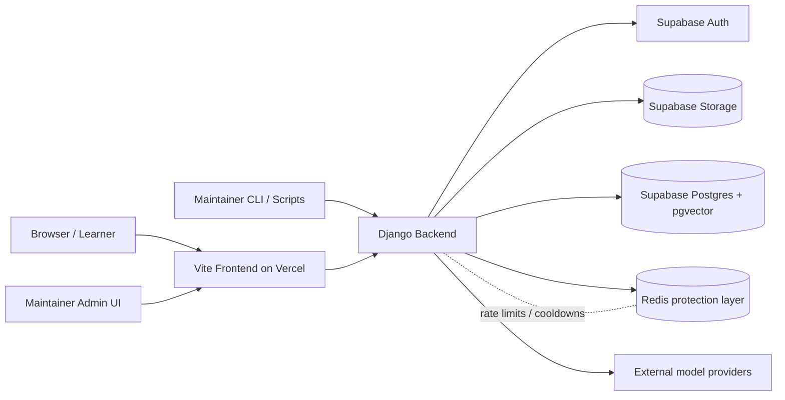

---
stepsCompleted:
  - step-01-validate-prerequisites
  - step-02-design-epics
  - step-03-create-stories
  - step-04-final-validation
inputDocuments:
  - _bmad-output/planning-artifacts/prd.md
  - _bmad-output/planning-artifacts/architecture.md
  - _bmad-output/planning-artifacts/ux-design-specification.md
  - _bmad-output/planning-artifacts/ux-color-themes.html
  - _bmad-output/planning-artifacts/ux-design-directions.html
  - archive/docs/planning-artifacts/global_governance_version_c_build_roadmap.md
lastEdited: '2026-05-02'
editHistory:
  - date: '2026-05-02'
    summary: 'Rebaselined Epic 5 and supporting requirements for the approved Django chatbot-backend pivot and private maintainer admin operations.'
  - date: '2026-05-02'
    summary: 'Patched Epic 5 and Epic 6 story coverage to close operational, validation, and future-scope gaps found in review.'
---

# Global-Governance - Epic Breakdown

## Overview

This document provides the complete epic and story breakdown for Global-Governance, decomposing the requirements from the PRD, UX Design if it exists, and Architecture requirements into implementable stories.

## Requirements Inventory

### Functional Requirements

- FR1: Learners can move through a complete Global Governance learning experience from introduction through conclusion within a single web session.
- FR2: Learners can access structured explanations of Global Governance, its major actors, and its significance in contemporary world affairs.
- FR3: Learners can access structured explanations of the United Nations, its purpose, and its institutional role in global governance.
- FR4: Learners can access explanations of the limits, criticisms, and enforcement challenges of global governance.
- FR5: Learners can access a real-world case study centered on the West Philippine Sea as an applied example of global governance in practice.
- FR6: Learners can access concluding insights and references that connect the educational experience back to the project's core thesis.
- FR7: Learners can consume the educational content without requiring account creation or personal profile setup.
- FR8: Learners can navigate the product as a continuous section-based experience.
- FR9: Learners can move directly to major sections of the experience through visible navigation controls.
- FR10: Learners can understand where they are in the learning flow and what major content areas remain.
- FR11: Learners can explore the content in both guided sequential order and selective self-directed order.
- FR12: Learners can recover orientation after jumping between sections or modules.
- FR13: Learners can explore the major organs of the United Nations through an interactive module that distinguishes their functions, powers, and limits.
- FR14: Learners can compare institutional roles and limitations within the United Nations without relying on long-form static text alone.
- FR15: Learners can explore the West Philippine Sea case through an interactive dossier or timeline-based experience.
- FR16: Learners can examine the relationship between legal rulings, geopolitical realities, and weak enforcement within the case study.
- FR17: Learners can use interactive elements that reinforce understanding of the topic rather than merely decorate the experience.
- FR18: Learners can access layered content that separates summary explanation from supporting detail.
- FR19: Learners can access section recaps, visible hierarchy, and next-step cues that help them re-enter the main learning flow after reviewing a section or module.
- FR20: Learners can access simplified and expanded explanation depth through adaptive depth features when those features are enabled.
- FR21: Learners can reinforce understanding through synthesis, recap, or clarification moments within the experience.
- FR22: Learners can engage with a hero or opening experience that establishes context, identity, and tone for the topic.
- FR23: Learners can ask project-related questions through an integrated chatbot experience.
- FR24: The chatbot can answer using approved project materials as its response basis.
- FR25: The chatbot can refuse, redirect, or safely handle questions that fall outside the approved project scope.
- FR26: The chatbot can provide on-page text answers with supporting source information or a visible fallback state when support is weak, delayed, or temporarily limited by public-chat protection rules.
- FR27: Learners can use the chatbot to clarify concepts encountered in the main learning flow.
- FR28: The chatbot can communicate when support is weak or insufficient instead of presenting unsupported certainty.
- FR29: Learners can recognize that chatbot responses are grounded in project-approved material rather than generic open-ended generation.
- FR30: Learners can access visible references or source information that support the academic content of the experience.
- FR31: Learners can inspect source support connected to educational content and chatbot responses.
- FR32: Evaluators can inspect evidence that the project's explanatory content is grounded in approved and disciplined source material.
- FR33: Evaluators can distinguish the chatbot's bounded academic role from that of a general-purpose assistant.
- FR34: The product can preserve alignment between its educational content, approved references, and chatbot-supported answers.
- FR35: Maintainers can define and manage the set of approved materials used to support the chatbot experience.
- FR36: Maintainers can prepare project content and source materials for use in the chatbot support flow.
- FR37: Maintainers can validate that the chatbot behaves within topic boundaries and that public-chat protection rules behave correctly before demo or review use.
- FR38: Maintainers can verify that major interactive sections, content flows, and educational modules are functioning before presentation.
- FR39: Maintainers can validate demo readiness across the learning flow, interactive modules, and chatbot reliability before live use.
- FR40: Maintainers can update or refine educational content without redesigning the full product structure.
- FR41: Maintainers can support local development and validation workflows for the chatbot-related experience.
- FR42: The product can support a classroom-demo walkthrough that presents the core learning flow, flagship modules, references, and chatbot interaction with no placeholder content in core sections and no broken UI states during the scripted demo.
- FR43: The product can add enhanced presentation features beyond the MVP while preserving successful completion of the core learning flow in scripted walkthrough testing.
- FR44: The product can support a Student / Expert mode that changes explanation depth when that feature is introduced.
- FR45: The product can support richer chatbot guidance and educational assistance in post-MVP phases.
- FR46: The product can support a future scenario-based simulator that allows learners to explore global governance through applied interactive decision or exploration flows.

### NonFunctional Requirements

- NFR1: The product shall render the initial learning experience in a usable state within 3 seconds on the reference demo device, measured from navigation start to first interactive paint in a cold-load test under normal broadband conditions.
- NFR2: Core navigation actions, section transitions, and primary interactive learning modules shall respond within 1 second at the 95th percentile on target devices, measured from user input to visible response in scripted interaction tests.
- NFR3: UI animation, scroll-enhanced motion, and optional showcase scenes shall preserve readability and interaction usability, measured by a reference-device test in which core text remains unobstructed and the heaviest animated section maintains at least 30 FPS with no blocked controls.
- NFR4: Below-the-fold experiences shall not delay the initial interactive state, and any deferred media or scenes shall load after first render of the above-the-fold content, verified by network waterfall and viewport-entry checks.
- NFR5: The chatbot shall show a loading state within 0.5 seconds of submission and return a usable answer or fallback within 8 seconds at the 95th percentile under normal demo conditions.
- NFR6: The product shall not require user account creation, shall not store names, emails, or student IDs in persistent logs, and shall retain any development chat logs only in anonymized or session-scoped form that maintainers can delete.
- NFR7: Approved source materials, chatbot-related content assets, and supporting data stores shall be writable only by designated maintainers, and unauthorized write attempts shall be denied in access-control tests.
- NFR8: All data exchanged between the client, backend, and data services shall use encrypted transport, with HTTPS and TLS 1.2 or higher and no plain-HTTP requests in security checks.
- NFR9: In a validation set of off-topic prompts, the chatbot shall refuse or redirect 100% of requests; in grounded-answer tests, factual claims shall map to approved source material before being presented as authoritative.
- NFR10: The public chatbot shall allow no more than 10 submissions per 60-second window per anonymous session and shall enforce a 60-second cooldown after 3 consecutive abuse-triggering prompts, without requiring learner accounts.
- NFR11: Environment variables and service credentials shall be kept outside source-controlled application code, with secret-scan validation returning zero high-confidence secrets in the repository.
- NFR12: Approved source bundles shall be versioned, and any change to approved materials shall be detectable in a pre-release content diff before new answers are generated from them.
- NFR13: The product shall complete a scripted demo walkthrough covering core navigation, learning modules, references, and chatbot interaction without restart or manual repair in a single session.
- NFR14: If a non-core premium element is disabled or fails, the core educational flow shall still allow completion of the main learning journey in smoke testing.
- NFR15: If chatbot support is weak, delayed, unavailable, or temporarily rate-limited, the UI shall display a visible fallback or cooldown status within 2 seconds and keep all non-chat content interactive.
- NFR16: In content consistency checks, all visible references and chatbot citations shall resolve to approved materials, and sampled answers shall not contradict the PRD's approved definitions or case facts.
- NFR17: The final experience shall pass an accessibility audit with zero critical issues, a contrast ratio of at least 4.5:1 for body text, and no blocked keyboard-only paths in the main learning flow.
- NFR18: The main learning flow shall use semantic heading structure, body text of at least 16 px, and visual contrast that meets WCAG AA in static contrast checks.
- NFR19: All major navigation and interactive controls shall be reachable and operable with keyboard only, with visible focus states present on every interactive element in the main flow, verified by a keyboard-only walkthrough and focus-state audit at 360 px, 768 px, and desktop breakpoints.
- NFR20: When reduced-motion is enabled, the page shall suppress nonessential looping motion, parallax effects, and optional showcase scenes; in normal mode, the heaviest animated section shall maintain at least 30 FPS on the reference device.
- NFR21: At 360 px, 768 px, and desktop breakpoints, the main learning flow shall require no horizontal scrolling, preserve readable text, and keep all core sections accessible in responsive smoke tests.
- NFR22: A maintainer shall be able to set up the chatbot-related local workflow from a clean clone by following the documented steps successfully on the reference workstation within 30 minutes, including source bundle preparation and protection configuration, with no manual code changes required.
- NFR23: An approved source document processed twice with unchanged input shall produce the same retrievable chunk set and metadata, and ingestion shall succeed for all supported file types in the validation set.
- NFR24: In a fixed validation question set, 100% of factual chatbot answers shall cite approved materials, and every cited source shall exist in the retrieval set used for that response.
- NFR25: With any nonessential integration disabled, the user shall still be able to access all core sections and complete the main learning flow in a smoke test without page restart or manual recovery.

### Additional Requirements

- Starter template: Use the shadcn/ui Vite scaffold and treat `pnpm dlx shadcn@latest init -t vite` as the first implementation story.
- Frontend foundation: Build the site as a React + Vite + TypeScript SPA with Tailwind CSS, Motion, Lenis, shadcn/ui, React Icons, React Three Fiber, and `@react-three/drei`.
- Hosting split: Deploy the frontend on Vercel, use Django as the backend orchestration layer, and use Supabase as the data platform for Auth, Storage, Postgres, and pgvector.
- Content split: Keep repo-managed presentation content separate from the chatbot knowledge base so site copy and retrieval data can evolve independently.
- Source of truth: Store visible educational page copy in typed repo content modules and keep approved chatbot source files in Supabase Storage.
- Retrieval store: Store chunked retrieval records, embeddings, and citation data in Supabase Postgres with pgvector.
- Validation boundary: Use TypeScript types internally and runtime schema validation at ingestion, chat request/response, citation payload, and source metadata boundaries.
- API style: Use REST-style HTTP JSON endpoints with the approved Django route families for public chat, prompt suggestions, admin source stewardship, ingestion, validation, and audit review.
- No learner auth: The MVP must not require learner authentication or expose a public maintainer dashboard in the learner-facing flow.
- Maintainer workflow: Support maintainer actions through protected Django admin APIs, a private stewardship surface, and local scripts for reproducible operational workflows.
- Security boundary: Keep public read access limited to what the frontend must render and protect source writes, ingestion, and retrieval behind service-role or maintainer-only execution contexts.
- Data protection: Enable Row Level Security for Supabase tables so public clients cannot mutate chatbot source data.
- Secret handling: Store service credentials only in server-side environments and platform secrets, and separate public browser keys from private ingestion and orchestration secrets.
- Server-side orchestration: Run chat, retrieval, topic guard checks, safety checks, ingestion logic, and protected admin actions server-side through Django.
- Protection layer: Use Redis in the MVP only for public-chat rate limiting, abuse counters, cooldown flags, and short-lived support state.
- Cache policy: Do not use Redis as the source of truth for approved documents, chunks, embeddings, or citations, and do not broadly cache grounded chat answers in the MVP.
- State management: Use local component state by default and thin React contexts only for cross-cutting concerns such as navigation state, reduced-motion preferences, chat panel state, and future Student / Expert mode.
- Routing: Use a single-page anchor-navigation architecture in the MVP and avoid React Router unless the project expands into separate page flows later.
- Performance: Lazy-load hero 3D assets, chatbot logic, optional showcase animation code, and any module not needed for first render.
- Motion policy: Keep GSAP out of the default path unless a specific sequence requires it, and keep the main narrative readable even if premium feature chunks are delayed or fail.
- Test placement: Co-locate frontend unit/component tests or keep them under `src/tests`, place Django backend tests under `backend/tests`, and keep any smoke validation scripts in a dedicated top-level testing area.
- Response envelope: Standardize all API responses on a consistent `{ success, data, error }` envelope and use typed success states for off-topic, weak-support, and refusal outcomes.
- Error handling: Separate user-safe messages from debug details, return structured server errors with stable codes, and avoid exposing raw stack traces in the UI.
- Loading states: Use explicit `idle`, `loading`, `success`, `weakSupport`, `refused`, and `error` states, and place loading UI close to the affected surface.
- Deployment workflow: Use reviewed frontend deployments, Django service deployments, and Supabase migrations instead of ad hoc dashboard edits.
- Environment config: Separate browser-safe variables, frontend build-time variables, server-only secrets, and local development secrets, and document `.env` conventions clearly.
- Monitoring: Use Vercel runtime visibility for frontend delivery concerns plus Django and Supabase logs for chat, auth, database, and ingestion debugging.
- Reproducibility: Support clean-clone local chatbot setup within 30 minutes and deterministic ingestion behavior for approved-source materials.
- File organization: Organize frontend code by feature boundary, keep shared UI primitives in `src/components/ui`, feature composites in feature-owned folders, and shared backend helpers in `backend/common`.
- Content ownership: Keep frontend code from writing directly to chatbot corpus tables.

### Boundary Alignment Notes

- Browser clients may call only the public chat and suggestion endpoints plus static content delivery.
- Ingestion endpoints remain maintainer-only operational surfaces and must never be called directly from normal learner UI flows.
- Django remains the only layer allowed to orchestrate privileged retrieval, service-role access, model calls, source bundle formatting, and protected maintainer operations.
- Redis remains a server-side protection service only, accessed from Django and never from the browser.
- Local development may use a disposable Redis instance or mocked adapter so frontend and content workflows remain runnable when protection services are offline.

**System Context:**

### UX Design Requirements

- UX-DR1: Implement a themeable design system with Tailwind CSS and shadcn/ui primitives, then build custom composites for the hero, scrollytelling flow, UN Command Center, West Philippine Sea dossier, and chatbot surfaces.
- UX-DR2: Apply the approved hybrid visual direction with Diplomatic Editorial as the full-site base, Strategic Atlas cues for structure, Institutional Ledger for references, Casefile Immersion for the case study, and Command Narrative for the UN module.
- UX-DR3: Define semantic color tokens for deep navy, elevated navy, parchment surface, muted paper, muted gold primary accent, teal secondary accent, and muted rust tension accent.
- UX-DR4: Support alternating atmospheric dark sections and lighter reading surfaces, with gold used for significance, teal for guidance, and rust only for conflict or warning.
- UX-DR5: Implement typography with a serif display face for major headings and a clean sans-serif for body text, navigation, and UI labels at the specified size and line-height scale.
- UX-DR6: Implement the spacing and layout system with an 8px base unit, 12-column desktop grid, 8-column tablet grid, 4-column mobile grid, 1200-1280 px max width, and 60-72 character reading widths.
- UX-DR7: Create a Hero Narrative Frame for the opening section with a strong visual frame and a clear call to continue.
- UX-DR8: Create a Section Progress Rail for orientation, active/completed section states, and quick re-entry into major chapters.
- UX-DR9: Create a Chapter Transition Block to separate the major conceptual chapters and reset attention before the next section.
- UX-DR10: Create a Source-Aware Chat Panel shell with a floating desktop presentation and a bottom-sheet mobile presentation.
- UX-DR11: Create a UN Organ Explorer that supports organ selection, a summary panel, role/power/limit indicators, and comparison behavior.
- UX-DR12: Create a West Philippine Sea Interactive Dossier that uses an evidence-led timeline, legal context, a ruling-versus-reality comparison, and a source drawer.
- UX-DR13: Create an Insight Recap Card for synthesis and re-entry checkpoints at the end of major chapters.
- UX-DR14: Create a Reference Evidence Drawer for source inspection without cluttering the main learning flow.
- UX-DR15: Build the three-level button hierarchy with one dominant primary action per local area and action-first labels.
- UX-DR16: Implement feedback patterns for success, information, warning, error, and protection states that answer what happened, what it means, and what to do next.
- UX-DR17: Implement the chatbot form pattern with a labeled input, prompt suggestions, obvious submit affordance, visible loading, cooldown guidance, and preserved context.
- UX-DR18: Implement navigation with a stable top-level section nav, visible active state, progress cues, return-to-top behavior, and stable jump targets.
- UX-DR19: Keep internal module navigation aligned with the main story system using tabs, timelines, drawers, and cards that preserve context.
- UX-DR20: Implement loading, empty, overlay, and progressive disclosure patterns consistently across the site.
- UX-DR21: Use a mobile-first, desktop-priority responsive strategy that preserves narrative clarity and module usability across the 360, 480, 768, 1024, and 1280 px breakpoints.
- UX-DR22: Ensure the 360 px experience has no horizontal scrolling and keeps text readable and controls touch-friendly.
- UX-DR23: Build WCAG 2.1 AA-aligned accessibility with semantic headings, strong contrast, visible focus, keyboard-operable controls, 44x44 touch targets, reduced motion, no hover-only essential information, and screen-reader-friendly labels.
- UX-DR24: Treat accessibility as a design constraint and let the readable option win when premium effects conflict with comprehension.
- UX-DR25: Make motion and selective 3D degrade gracefully, with Motion as the default animation layer, Lenis for scroll feel, GSAP only for isolated showcase scenes, and reduced-motion variants for motion-enhanced sections.
- UX-DR26: Keep the page feeling like one continuous academic experience with consistent trust cues such as references, source chips, and section labels.
- UX-DR27: Keep the opening hero simplified for the MVP and avoid dependence on a live Student / Expert mode switch at launch.
- UX-DR28: Preserve post-MVP expansion points for Student / Expert mode, richer chatbot source interaction, and the future simulator.
- UX-DR29: Optimize the experience for classroom and demo settings and prioritize presentation reliability over spectacle.
- UX-DR30: Validate the design with cross-browser responsive testing, keyboard-only walkthroughs, reduced-motion testing, contrast checks, zoom and text-resize checks, touch-target checks, and low-risk demo conditions.
- UX-DR31: Keep the component strategy layered by using primitives for structure and controls, then custom composites for story flow, institutional exploration, case-study storytelling, and source-aware learning.
- UX-DR32: Provide mobile-specific optimized versions for flagship modules when layouts need to collapse into stacked, hybrid, or bottom-sheet patterns.
- UX-DR33: Make source credibility visible through source chips, citation metadata, and evidence surfaces in chatbot and references contexts.
- UX-DR34: Use the approved reference cue palette consistently, with Diplomatic Editorial as the primary site language and Strategic Atlas, Institutional Ledger, Casefile Immersion, and Command Narrative applied to the relevant sections.
- UX-DR35: Treat the hero, UN Command Center, West Philippine Sea dossier, and source-aware chatbot states as the flagship memorable moments of the experience.

### FR Coverage Map

FR1: Epic 1 - Core guided learning journey from opening hero through conclusion.
FR2: Epic 1 - Introductory and conceptual explanation across the core learning flow.
FR3: Epic 2 - United Nations institutional explainer and organ comparison experience.
FR4: Epic 1 - Limits, criticisms, and enforcement challenges in the core narrative.
FR5: Epic 3 - West Philippine Sea case study and interactive dossier.
FR6: Epic 4 - Conclusion and references that reinforce the core thesis.
FR7: Epic 1 - Account-free single-session content access.
FR8: Epic 1 - Continuous section-based experience architecture.
FR9: Epic 1 - Visible navigation controls for major sections.
FR10: Epic 1 - Orientation and progress awareness in the learning flow.
FR11: Epic 1 - Guided and self-directed exploration modes.
FR12: Epic 1 - Recovery after jumping between sections or modules.
FR13: Epic 2 - Interactive UN organs module.
FR14: Epic 2 - Comparison of institutional roles and limitations.
FR15: Epic 3 - Interactive West Philippine Sea dossier or timeline.
FR16: Epic 3 - Relationship between rulings, reality, and weak enforcement.
FR17: Epic 1 - Interactive elements that reinforce understanding.
FR18: Epic 1 - Layered content with summary and supporting detail.
FR19: Epic 1 - Recaps, hierarchy, and re-entry cues.
FR20: Epic 6 - Adaptive explanation depth for future mode support.
FR21: Epic 1 - Synthesis and clarification moments in the core experience.
FR22: Epic 1 - Hero or opening experience that establishes context and tone.
FR23: Epic 4 - Integrated chatbot question asking experience.
FR24: Epic 4 - Approved-material grounding for chatbot answers.
FR25: Epic 4 - Off-scope refusal and safe redirection.
FR26: Epic 4 - On-page answers with source support or fallback state.
FR27: Epic 4 - Chatbot clarification for concepts from the learning flow.
FR28: Epic 4 - Explicit weak-support communication.
FR29: Epic 4 - Clear recognition of grounded, approved-material responses.
FR30: Epic 4 - Visible references and source information.
FR31: Epic 4 - Source support inspection for content and chatbot responses.
FR32: Epic 4 - Evidence that explanatory content is grounded in approved sources.
FR33: Epic 4 - Bounded academic chatbot role distinct from a general assistant.
FR34: Epic 4 - Alignment between content, references, and chatbot answers.
FR35: Epic 5 - Approved material management for the chatbot experience.
FR36: Epic 5 - Preparing content and source materials for chatbot support.
FR37: Epic 5 - Topic-bound chatbot validation and protection rule checks.
FR38: Epic 5 - Verification that major interactive sections and modules function before presentation.
FR39: Epic 5 - Demo-readiness validation across the learning flow and chatbot.
FR40: Epic 5 - Updating educational content without redesigning the product structure.
FR41: Epic 5 - Local development and validation workflows for the chatbot experience.
FR42: Epic 5 - Classroom-demo walkthrough support with no placeholder or broken core states.
FR43: Epic 6 - Enhanced presentation features that preserve the core flow.
FR44: Epic 6 - Student / Expert mode that changes explanation depth.
FR45: Epic 6 - Richer chatbot guidance and educational assistance in post-MVP phases.
FR46: Epic 6 - Future scenario-based simulator support.

### NFR Coverage Map

NFR1: Epic 1 - rapid first usable render and deferred media loading.
NFR2: Epic 1, Epic 2, Epic 3 - responsive core navigation and interactive modules.
NFR3: Epic 1, Epic 2, Epic 3, Epic 6 - motion, readability, and animation usability.
NFR4: Epic 1 - below-the-fold deferral without delaying the initial interactive state.
NFR5: Epic 4 - chatbot loading feedback and usable answer or fallback timing.
NFR6: Epic 5 - account-free use and anonymized or session-scoped chat logs.
NFR7: Epic 5 - maintainer-only writes and access-control protection.
NFR8: Epic 5 - encrypted transport and secure service boundaries.
NFR9: Epic 4, Epic 5 - off-topic refusal and grounded-answer validation.
NFR10: Epic 5 - public-chat rate limits and cooldown enforcement.
NFR11: Epic 5 - server-side secrets and repository secret-scanning.
NFR12: Epic 5 - versioned approved-source bundles and pre-release diffs.
NFR13: Epic 5 - scripted demo walkthrough reliability.
NFR14: Epic 5, Epic 6 - graceful degradation when non-core elements fail or are disabled.
NFR15: Epic 4, Epic 5 - weak-support and cooldown fallback states.
NFR16: Epic 4, Epic 5 - citation integrity and content consistency checks.
NFR17: Epic 1, Epic 2, Epic 3, Epic 4 - accessibility audit readiness across the main flow.
NFR18: Epic 1 - semantic headings, readable body text, and WCAG AA-aligned contrast.
NFR19: Epic 1, Epic 2, Epic 3, Epic 4 - keyboard reachability and visible focus states.
NFR20: Epic 1, Epic 2, Epic 3, Epic 6 - reduced motion and animation performance.
NFR21: Epic 1, Epic 2, Epic 3, Epic 4 - responsive layouts with no horizontal scrolling.
NFR22: Epic 5 - clean-clone maintainer setup within the documented time budget.
NFR23: Epic 5 - deterministic ingestion and supported file-type handling.
NFR24: Epic 4, Epic 5 - approved-material citations and retrieval integrity.
NFR25: Epic 5, Epic 6 - smoke-test resilience with nonessential integrations disabled.

### UX Coverage Map

UX-DR1-6: Epic 1, Epic 2, Epic 3, Epic 4, Epic 5, Epic 6 - shared design system, typography, spacing, and responsive layout foundations.
UX-DR7-9: Epic 1 - hero narrative, progress rail, and chapter transition framing.
UX-DR10: Epic 4 - source-aware chat panel shell and presentation states.
UX-DR11: Epic 2 - UN organ explorer structure and comparison behavior.
UX-DR12: Epic 3 - West Philippine Sea dossier structure and evidence-led framing.
UX-DR13-16: Epic 1, Epic 3, Epic 4 - recaps, layered detail, comparison surfaces, and source-led trust cues.
UX-DR17-20: Epic 1, Epic 2, Epic 3, Epic 6 - comprehension-first interaction, motion policy, and depth-mode support.
UX-DR21-25: Epic 1, Epic 2, Epic 3, Epic 4, Epic 5 - accessibility, focus management, and device-specific layout behavior.
UX-DR26-35: Epic 1, Epic 2, Epic 3, Epic 4, Epic 5, Epic 6 - source credibility, flagship moments, platform polish, and future presentation states.

## Epic List

### Implementation Enablement Notes

- Story 1.1 is the initial project-foundation bootstrap story. It exists to establish the approved starter template and shared frontend scaffold.
- Story 5.4 is the backend-foundation pivot story. It establishes the Django service boundary before deeper chatbot implementation continues.
- Story 5.11 is the maintainer-workflow bootstrap story. It exists to establish the clean-clone setup path and local operational workflow after the Django-backed chatbot path and demo rehearsal plan are in place.
- Story 5.12 is the operational-hardening story. It closes the release, audit, security, and observability gaps that must exist before the Django-backed stack is considered demo-ready.
- These setup and pivot stories are intentionally separated between product foundation, backend rebaseline, and maintainer operations so implementation ownership stays easy to scan.

### Epic 1: Guided Learning Journey
Learners can move through a complete, section-based learning experience with clear orientation, layered explanation, recap support, and a strong opening-to-conclusion narrative.
**FRs covered:** FR1, FR2, FR4, FR7, FR8, FR9, FR10, FR11, FR12, FR17, FR18, FR19, FR21, FR22

### Epic 2: UN Institutional Explorer
Learners can explore the United Nations as an interactive institutional system, compare organs, and understand each organ's function, power, and limits without relying on dense static text alone.
**FRs covered:** FR3, FR13, FR14

### Epic 3: West Philippine Sea Case Dossier
Learners can investigate the West Philippine Sea as an evidence-led case study, trace the timeline, and connect legal rulings to geopolitical reality and weak enforcement.
**FRs covered:** FR5, FR15, FR16

### Epic 4: Grounded Guidance and Trust
Learners can ask bounded questions, inspect approved sources, and use references and chatbot support to reinforce the thesis while preserving academic credibility. This epic closes the experience after the main narrative journey in Epic 1 by providing the final trust, references, and bounded guidance surfaces.
**FRs covered:** FR6, FR23, FR24, FR25, FR26, FR27, FR28, FR29, FR30, FR31, FR32, FR33, FR34

### Epic 5: Content Stewardship and Demo Reliability
Maintainers can manage approved source material, operate the Django-backed chatbot stack safely, and rehearse a stable classroom demo that keeps the core experience reliable.
**FRs covered:** FR35, FR36, FR37, FR38, FR39, FR40, FR41, FR42

### Epic 6: Adaptive Presentation and Future Expansion
The product can support deeper explanation modes, richer presentation features, and future simulator-style learning without disrupting the core learning flow.
**FRs covered:** FR20, FR43, FR44, FR45, FR46

## Epic 1: Guided Learning Journey

Learners can move through a complete, section-based learning experience with clear orientation, layered explanation, recap support, and a strong opening-to-conclusion narrative.

### Story 1.1: Set Up Initial Project from Starter Template

As a developer,
I want to initialize the project from the approved starter template,
So that the learning journey begins from the documented Vite, TypeScript, Tailwind, and shadcn/ui foundation.

**Acceptance Criteria:**

**Given** a clean clone of the repository
**When** I run the approved starter-template setup path
**Then** the frontend project is scaffolded from the documented starter approach
**And** the base app starts from the correct React + Vite + TypeScript foundation

**Given** the starter setup is complete
**When** I inspect the project structure
**Then** the shared UI primitives, feature folders, and environment conventions follow the documented architecture
**And** the setup is aligned with the approved implementation direction

**Given** the starter setup is complete
**When** I inspect the app boundary and helper folders
**Then** browser-facing code remains separated from privileged backend helpers
**And** no privileged retrieval or Redis logic is exposed directly to the frontend

**Given** the project depends on approved frontend libraries
**When** I install the dependencies
**Then** Motion, Lenis, shadcn/ui, React Icons, React Three Fiber, and the other documented frontend dependencies are available in the project
**And** the project can run locally without manual code changes to the starter foundation

**Given** the foundation is ready
**When** I start the development server
**Then** the app renders successfully and the baseline configuration supports later feature work
**And** the setup does not require future stories to fix the starter scaffold

### Story 1.2: Open the Journey

As a student presenter,
I want the opening hero to clearly frame the topic and invite me to continue,
So that I immediately understand what this site is and how to begin.

**Acceptance Criteria:**

**Given** the site loads on first visit
**When** the hero appears
**Then** it communicates Global Governance as the topic and signals that the experience is interactive, not a static report
**And** the opening content is readable without requiring prior navigation

**Given** I view the hero on desktop or mobile
**When** the layout renders
**Then** the title, subtitle, and primary call to action remain readable without horizontal scrolling or clipping
**And** the primary action remains visually clear

**Given** I activate the primary call to action
**When** I continue
**Then** the page moves into the learning journey without losing context or requiring a page reload
**And** I can still understand how the opening relates to the rest of the site

**Given** reduced motion is enabled
**When** the hero renders
**Then** the opening experience still feels intentional and does not depend on nonessential looping motion or showcase animation
**And** the hero remains understandable in reduced-motion mode

### Story 1.3: Navigate the Story

As a learner,
I want visible navigation and orientation cues,
So that I can move between major sections without getting lost.

**Acceptance Criteria:**

**Given** the major sections are present
**When** I use the top navigation or section controls
**Then** I can jump directly to any major section in the learning flow
**And** the navigation targets remain stable

**Given** I move from one section to another
**When** the active section changes
**Then** the navigation state or progress cue updates to show where I am
**And** I can see which part of the journey I am in

**Given** I jump away from the current section
**When** I return
**Then** I can recover my place with visible labels or progress cues
**And** the page does not leave me disoriented

**Given** I use keyboard only
**When** I move through navigation controls
**Then** each control is reachable and has a visible focus state
**And** the interaction remains usable without a pointer device

**Given** I use a small screen
**When** navigation collapses
**Then** it remains usable and does not cover the core content
**And** the section flow stays readable

### Story 1.4: Explore the Core Narrative

As a learner,
I want the main content to be organized in layered sections,
So that I can understand the topic without being overwhelmed by dense text.

**Acceptance Criteria:**

**Given** I scroll through the main explanatory sections
**When** each section renders
**Then** it presents a concise summary before supporting detail
**And** the content reads like a guided explanation rather than a wall of text

**Given** I review the sections
**When** a topic becomes dense
**Then** interactive or expandable content helps clarify the point instead of adding decorative noise
**And** the interaction improves comprehension

**Given** I finish a major content section
**When** I reach its end
**Then** I see a recap or synthesis that reinforces the main idea
**And** the recap helps me retain the point before moving on

**Given** I read the core narrative from start to finish
**When** I reach the conclusion
**Then** the learning flow connects back to the project's thesis
**And** the site feels like one coherent story

**Given** I am on a typical student device
**When** I consume the narrative
**Then** I can do so without creating an account or profile
**And** the experience stays accessible to a first-time visitor

### Story 1.5: Re-enter with Recaps

As a learner,
I want recap and next-step cues after major sections,
So that I can re-enter the learning flow confidently after exploring detail.

**Acceptance Criteria:**

**Given** I complete a major section or module
**When** I reach the recap area
**Then** I see a short synthesis of the key takeaway
**And** the recap is short enough to scan quickly

**Given** I jump into the site from another section
**When** I use the re-entry cues
**Then** I can understand what I just missed and what comes next
**And** I can return to the main journey without guessing

**Given** I review a section twice
**When** I read its recap
**Then** it helps me connect that section back to the larger argument
**And** it reinforces the thesis instead of repeating everything verbatim

**Given** I use the recap cues on mobile or desktop
**When** they render
**Then** they remain readable and visually consistent with the rest of the journey
**And** they do not interrupt the content flow

**Given** I need clarification
**When** I review the recap
**Then** I can continue without losing my place in the story
**And** I know what action makes sense next

### Story 1.6: Shape the Editorial System

As a learner,
I want the site to use a coherent premium visual system,
So that I can trust the presentation and focus on the content.

**Acceptance Criteria:**

**Given** the journey is rendered
**When** I move between sections
**Then** the site uses a consistent color, typography, spacing, and surface treatment system
**And** the sections feel like part of one experience

**Given** a primary action appears
**When** I inspect the controls in a section
**Then** one action is visually dominant and secondary actions remain supportive
**And** the hierarchy is obvious at a glance

**Given** a major chapter transition appears
**When** the topic changes
**Then** the transition resets attention without fragmenting the experience
**And** the flow still feels connected

**Given** references or source surfaces appear
**When** I view them
**Then** they are visually distinct and readable without feeling disconnected from the main design
**And** the treatment reinforces academic credibility

**Given** the approved hybrid direction is applied
**When** I compare the main journey and the support surfaces
**Then** the visual language feels premium, diplomatic, and academically serious
**And** the palette and hierarchy support comprehension

### Story 1.7: Keep the Core Journey Usable

As a learner,
I want the core journey to remain accessible, responsive, and motion-safe,
So that I can use it comfortably on different devices and settings.

**Acceptance Criteria:**

**Given** I view the site at 360 px, 768 px, and desktop widths
**When** I scroll the core journey
**Then** there is no horizontal scrolling and the text remains readable
**And** the layout adapts without hiding core content

**Given** I navigate with keyboard only
**When** I move through the core journey
**Then** major controls are reachable and show visible focus states
**And** the full flow remains operable without a mouse

**Given** reduced motion is enabled
**When** the page loads
**Then** nonessential looping motion, parallax, and showcase effects are reduced or removed
**And** the page still communicates structure clearly

**Given** the core journey loads on the reference device
**When** I open the site
**Then** the initial learning experience becomes usable quickly and the main interactions respond without obvious delay
**And** the opening does not block access to the rest of the page

**Given** I use a touch device
**When** I interact with the core journey
**Then** buttons and navigation remain touch-friendly and do not block nearby content
**And** I can continue reading without accidental taps

**Given** the page content is displayed
**When** I review the main narrative
**Then** semantic headings and readable body text support the flow of the experience
**And** the presentation remains clear in an accessibility audit

## Epic 2: UN Institutional Explorer

Learners can explore the United Nations as an interactive institutional system, compare organs, and understand each organ's function, power, and limits without relying on dense static text alone.

### Story 2.1: Introduce the UN Command Center

As a learner,
I want the UN section to explain what the Command Center is for,
So that I understand the institutional context before I start exploring the organs.

**Acceptance Criteria:**

**Given** I open the UN section
**When** the module renders
**Then** it introduces the United Nations as an institutional system within global governance
**And** it makes clear that the section is meant for exploration, not just reading

**Given** I arrive from the main learning journey
**When** the UN section loads
**Then** it feels like a continuation of the same page and preserves the broader narrative context
**And** the module has a clear entry point and section identity

**Given** the module is visible on desktop or mobile
**When** I inspect the layout
**Then** I can see the module's main entry controls and summary area without needing to hunt for them
**And** the controls are readable and labeled

**Given** I use keyboard only
**When** I enter the section
**Then** the module's primary controls are reachable and show visible focus states
**And** I can begin exploring without a pointer device

### Story 2.2: Inspect UN Organs

As a learner,
I want selecting a UN organ to reveal its role, powers, and limitations,
So that I can compare institutions quickly without relying on a long static explanation.

**Acceptance Criteria:**

**Given** the UN organ list is visible
**When** I select an organ
**Then** the detail panel updates to show that organ's role, scope of power, and limitation
**And** the selected state is obvious

**Given** I switch between different organs
**When** the selection changes
**Then** the information updates immediately without losing context
**And** I can tell the organs apart from the displayed content alone

**Given** I explore the organs in sequence
**When** I review the module
**Then** the content stays concise and structured rather than turning into one long wall of text
**And** the presentation supports comparison

**Given** I use keyboard navigation
**When** I move through the organs
**Then** each organ selection is reachable and focus visibility is preserved
**And** the interaction remains usable without a mouse

**Given** the organ details render
**When** I inspect the panel
**Then** I can understand why the organ matters in global governance
**And** the explanation supports the module's educational purpose

### Story 2.3: Compare Organs Across Devices

As a learner,
I want the UN module to support comparison on both large and small screens,
So that I can study the institutions comfortably regardless of device.

**Acceptance Criteria:**

**Given** I view the UN module on desktop
**When** the comparison view renders
**Then** the layout can present organ differences in a clear comparative structure
**And** the comparison remains readable without crowding the panel

**Given** I view the UN module on tablet or mobile
**When** the layout adapts
**Then** the module collapses into a stacked or hybrid layout that still preserves the key organ details
**And** no horizontal scrolling is required

**Given** reduced motion is enabled
**When** I switch organs or move through the module
**Then** motion is restrained and never obscures the text or state change
**And** the content remains understandable

**Given** I use keyboard only
**When** I explore comparison controls
**Then** every control is reachable and has a visible focus state
**And** I can complete the module without a mouse

**Given** I scan the module on any target breakpoint
**When** I look for the organ content
**Then** nothing depends on hover alone to understand the comparison
**And** the module remains readable and consistent with the main design language

## Epic 3: West Philippine Sea Case Dossier

Learners can investigate the West Philippine Sea as an evidence-led case study, trace the timeline, and connect legal rulings to geopolitical reality and weak enforcement.

### Story 3.1: Open the Case Dossier

As a learner,
I want the West Philippine Sea dossier to introduce the case and its purpose,
So that I understand why this section matters before I start exploring the evidence.

**Acceptance Criteria:**

**Given** I open the case study section
**When** the dossier renders
**Then** it identifies the West Philippine Sea as the topic and frames the section as an evidence-led investigation
**And** it explains that the section is designed to connect law, power, and enforcement

**Given** I arrive from the main learning journey
**When** the dossier loads
**Then** it feels like a continuation of the page narrative rather than a separate page
**And** the section has a clear entry point and label

**Given** I view the dossier on desktop or mobile
**When** the layout appears
**Then** the introductory summary and controls remain readable without horizontal scrolling
**And** the module feels visually distinct from the surrounding sections

**Given** I use keyboard only
**When** I enter the dossier
**Then** the primary entry controls are reachable and show visible focus states
**And** I can begin the section without a pointer device

### Story 3.2: Follow the Timeline

As a learner,
I want the case study to present the events in chronological order,
So that I can understand how the dispute developed over time.

**Acceptance Criteria:**

**Given** the timeline is visible
**When** I select an event
**Then** the detail view updates to show that event's context and significance
**And** the selected state is obvious

**Given** I move through the key events
**When** I progress through the sequence
**Then** the module includes the major milestones of the case, including the 2012 Scarborough Shoal incident, the 2013 arbitration filing, the 2016 ruling, and the post-ruling enforcement limitations
**And** the chronology remains clear

**Given** I review the event cards
**When** the timeline renders
**Then** the content stays readable and compact instead of becoming a long unstructured article
**And** the module helps me see the sequence at a glance

**Given** I use keyboard navigation
**When** I move between timeline events
**Then** each event is reachable and focus visibility is preserved
**And** the interaction remains usable without a mouse

**Given** I view the dossier on tablet or mobile
**When** the timeline adapts
**Then** it collapses into a stacked or hybrid layout that still preserves the chronological flow
**And** no horizontal scrolling is required

### Story 3.3: Compare Ruling and Reality

As a learner,
I want the dossier to show the legal ruling beside the geopolitical reality,
So that I can understand why the case demonstrates weak enforcement.

**Acceptance Criteria:**

**Given** I open the ruling-versus-reality view
**When** the comparison panel renders
**Then** I can see the legal or institutional ruling side alongside the real-world enforcement or geopolitical outcome
**And** the distinction between the two is easy to understand

**Given** I switch between the comparison states
**When** the state changes
**Then** the text and structure update without breaking the narrative flow
**And** the comparison remains tied to the case thesis

**Given** I read the comparison details
**When** I reach the explanatory text
**Then** it clearly connects the legal outcome to the enforcement gap and political reality
**And** it avoids turning into a generic conflict summary

**Given** reduced motion is enabled
**When** I move through the comparison
**Then** motion stays subtle and does not obscure the comparison or the text
**And** the state change remains understandable

**Given** I use the module on any target breakpoint
**When** the comparison view appears
**Then** it remains legible and does not depend on hover-only disclosure
**And** the section still feels like a single coherent case narrative

### Story 3.4: Inspect Case Evidence

As a learner,
I want to open source and evidence details inside the dossier,
So that I can verify the case study without leaving the section.

**Acceptance Criteria:**

**Given** I inspect an event or comparison panel
**When** I open the supporting evidence
**Then** I see a source drawer or evidence surface with the relevant source details
**And** the evidence is presented in a readable, inspectable format

**Given** I use the evidence drawer on desktop or mobile
**When** it opens
**Then** it uses a layout appropriate to the device, including a mobile-friendly stacked or bottom-sheet style if needed
**And** it does not block the main story flow longer than necessary

**Given** I navigate the evidence surface with the keyboard
**When** I open and close it
**Then** the controls are reachable and focus states remain visible
**And** I can return to the dossier without losing context

**Given** I review the sources
**When** I compare them to the case explanation
**Then** the evidence helps reinforce trust in the module's claims
**And** the source treatment feels integrated rather than decorative

**Given** I use reduced motion
**When** the evidence drawer appears
**Then** it opens without heavy motion that distracts from reading
**And** the content remains easy to inspect

## Epic 4: Grounded Guidance and Trust

Learners can ask bounded questions, inspect approved sources, and use references and chatbot support to reinforce the thesis while preserving academic credibility.

### Story 4.1: Close with Thesis and References

As a learner,
I want the closing section to summarize the thesis and show references,
So that I leave the experience with a clear takeaway and visible source support.

**Acceptance Criteria:**

**Given** I reach the end of the learning flow
**When** the conclusion renders
**Then** it restates the project's main thesis in a concise, readable form
**And** it connects the full experience back to the central argument

**Given** the references section is visible
**When** I inspect it
**Then** I can see the approved sources or source summaries that support the educational content
**And** the references are presented in a readable, inspectable format

**Given** I use the references on desktop or mobile
**When** I open a source detail or evidence surface
**Then** it remains accessible without breaking the flow of the page
**And** I can return to the conclusion without losing context

**Given** the closing section loads
**When** I review it
**Then** it feels like part of the same site design and not a separate document dump
**And** the section reinforces academic credibility

**Given** I inspect the conclusion and sources together
**When** I evaluate the content
**Then** I can see how the thesis and references support each other
**And** the end of the journey feels complete

### Story 4.2: Open the Source-Aware Chat

As a learner,
I want to open the chatbot and see suggested prompts,
So that I can ask project questions from anywhere in the experience without guessing where to start.

**Acceptance Criteria:**

**Given** I am anywhere in the learning flow
**When** I open the chatbot
**Then** the panel or dock appears without losing my place in the site
**And** I can close it and return to the same point

**Given** the chatbot opens
**When** I review the panel
**Then** it clearly presents itself as a bounded academic assistant rather than a general-purpose chatbot
**And** the prompt area is labeled and readable

**Given** suggested prompts are available
**When** I inspect the quick-start options
**Then** I can choose a prompt that helps me ask about the topic in the language of the course
**And** the suggestions reduce first-use friction

**Given** I use keyboard only
**When** I open, use, and close the panel
**Then** the input and controls are reachable and visibly focused
**And** the chat surface remains operable without a mouse

**Given** I open the chatbot on mobile
**When** the panel adapts
**Then** it uses a layout appropriate to the smaller screen without obscuring the rest of the site
**And** I can still continue the learning flow afterward

### Story 4.3: Receive Grounded Answers

As a learner,
I want chatbot responses to be grounded in approved materials with visible source support,
So that I can trust the answer and verify it against the project content.

**Acceptance Criteria:**

**Given** I ask a question that is within the approved project scope
**When** the chatbot responds
**Then** it answers from approved materials rather than open-ended speculation
**And** the answer stays aligned with the site's educational content

**Given** the chatbot returns a factual answer
**When** I inspect the response
**Then** I can see supporting source information or citation details
**And** the answer makes its grounding visible

**Given** the chatbot support is weak but still usable
**When** a response is returned
**Then** the UI shows a visible weak-support or fallback state instead of pretending certainty
**And** the user can tell what to do next

**Given** I compare the chatbot answer to the learning flow
**When** I review both
**Then** the response reinforces concepts encountered in the main experience
**And** the chatbot behaves like a helper for the site's curriculum, not a separate tool

**Given** I need to inspect the evidence behind a response
**When** I open the source details
**Then** I can see the relevant source support without losing the chat context
**And** the evidence is presented in a readable, inspectable format

### Story 4.4: Handle Refusal and Protection States

As a learner,
I want the chatbot to refuse off-topic prompts and show protection states clearly,
So that I understand when the assistant cannot help and can continue learning safely.

**Acceptance Criteria:**

**Given** I ask an off-topic question
**When** the chatbot evaluates it
**Then** it refuses or redirects the request instead of answering outside the approved scope
**And** the response stays calm and academically framed

**Given** the chatbot is under temporary protection or cooldown
**When** I submit another prompt
**Then** I see a clear cooldown or protection state
**And** the rest of the learning experience remains usable

**Given** the chatbot cannot provide strong support
**When** it responds
**Then** it communicates the limitation instead of presenting unsupported certainty
**And** it offers the next useful action

**Given** I trigger the protection layer repeatedly
**When** the rate limit is reached
**Then** the UI indicates that the chat is temporarily limited and not broken
**And** I can continue using the non-chat sections

**Given** I review the refusal or cooldown message
**When** I read the explanation
**Then** it makes the chatbot's bounded academic role obvious
**And** it does not feel punitive or confusing

## Epic 5: Content Stewardship and Demo Reliability

Maintainers can manage approved source material, validate chatbot behavior, and rehearse a stable classroom demo that keeps the core experience reliable.

### Story 5.1: Manage Approved Source Bundles

As a maintainer,
I want to define and version the approved source bundle,
So that I can keep the chatbot's knowledge base controlled and reviewable.

**Acceptance Criteria:**

**Given** I prepare an approved source set
**When** I register the materials for use
**Then** the source bundle is represented in a versioned, reviewable form
**And** I can see which materials are approved for grounding

**Given** I update an approved source file
**When** I review the change
**Then** I can inspect a pre-release diff before the new material is used for answers
**And** the update is traceable

**Given** I maintain the source bundle over time
**When** I add or remove materials
**Then** the bundle remains aligned with the project's approved content boundaries
**And** unsupported materials are not treated as authoritative

**Given** I need to refine educational content
**When** I update approved materials
**Then** I can do so without redesigning the full product structure
**And** the update stays localized to the source set

### Story 5.2: Prepare Sources for Ingestion

As a maintainer,
I want to ingest approved documents into the chatbot retrieval pipeline,
So that the assistant can answer from structured, searchable materials.

**Acceptance Criteria:**

**Given** I have approved source documents
**When** I run the ingestion workflow
**Then** the documents are normalized into retrievable records and metadata
**And** the pipeline preserves the approved-source separation from the site copy

**Given** I ingest the same approved document twice without changes
**When** I compare the outputs
**Then** I get the same retrievable chunk set and metadata
**And** the ingestion process is deterministic for unchanged input

**Given** I use a supported file type
**When** ingestion runs
**Then** the file is processed successfully into the retrieval store
**And** unsupported inputs are rejected or handled clearly

**Given** I submit a mixed or partially invalid ingestion batch
**When** one or more documents fail normalization, chunking, or embedding preparation
**Then** the workflow reports which items failed and why
**And** it does not leave the retrieval store in a silent partial-write state

**Given** I retry an already ingested document or re-run the same batch
**When** the source material is unchanged or duplicated by mistake
**Then** the workflow handles the duplicate deterministically through idempotent reuse, replacement, or an explicit maintainer decision
**And** it does not create conflicting retrieval records for the same approved source version

**Given** I prepare retrieval data for chatbot use
**When** the process completes
**Then** the resulting chunks, embeddings, and citation data are available in the intended storage layer
**And** they are not mixed into the public frontend asset path

### Story 5.3: Validate Chatbot Boundaries

As a maintainer,
I want to test the chatbot's grounding, refusal, and protection behavior,
So that I can trust it before a demo or review.

**Acceptance Criteria:**

**Given** I run a fixed validation question set
**When** the chatbot answers
**Then** every factual answer cites approved materials
**And** every cited source exists in the retrieval set used for that response

**Given** I submit off-topic prompts
**When** the chatbot evaluates them
**Then** it refuses or redirects 100% of those requests
**And** it does not produce unsupported answers

**Given** I trigger weak-support cases
**When** the chatbot cannot answer confidently
**Then** the UI exposes a visible fallback or weak-support state
**And** the rest of the site remains usable

**Given** I exceed the public-chat protection thresholds
**When** the chatbot is rate-limited or cooled down
**Then** I can verify the cooldown behavior and the 60-second protection response
**And** the system does not require learner accounts to enforce the rule

**Given** I inspect chatbot behavior for content accuracy
**When** I compare the output to the approved content
**Then** sampled answers do not contradict the PRD's approved definitions or case facts
**And** the chatbot remains clearly bounded to the project scope

### Story 5.4: Establish the Django Backend Foundation

As a maintainer,
I want a dedicated Django backend foundation for the chatbot and admin stack,
So that future backend work happens behind one consistent, secure orchestration boundary.

**Acceptance Criteria:**

**Given** the backend foundation story is implemented
**When** I inspect the repository structure
**Then** the Django project, backend app boundaries, shared backend utilities, and environment conventions are present in their documented locations
**And** the frontend remains separated from privileged backend code

**Given** the Django service is configured
**When** I start the local development workflow
**Then** the frontend, Django service, and Supabase local dependencies can run together in the documented setup path
**And** the backend can reach the intended Supabase services through server-only configuration

**Given** a public chat request or protected admin request reaches the backend
**When** the request is processed
**Then** the Django layer owns request validation, response envelopes, and downstream orchestration
**And** privileged model, retrieval, or service-role work is not exposed to the browser

**Given** untrusted input reaches an external backend boundary
**When** chat, ingestion, citation packaging, or source metadata handling begins
**Then** runtime schema validation is applied before deeper orchestration continues
**And** invalid payloads return structured user-safe errors instead of propagating malformed state

### Story 5.5: Add Supabase Auth Admin Authentication and Django Authorization

As a maintainer,
I want private maintainer authentication and protected Django authorization,
So that approved-source operations remain restricted without adding learner accounts.

**Acceptance Criteria:**

**Given** I access a protected maintainer route
**When** I am not authenticated as an approved maintainer
**Then** the request is denied with a clear protected-route response
**And** no source mutation action is performed

**Given** I sign in as an approved maintainer
**When** I call a protected admin endpoint
**Then** Django verifies the Supabase Auth identity before allowing the action
**And** the endpoint applies maintainer-only authorization checks consistently

**Given** maintainer access needs to be granted, changed, or revoked
**When** an administrator updates the approved-maintainer list or role mapping
**Then** the change becomes effective through a documented server-side provisioning path
**And** removed maintainers lose access without requiring learner-facing auth changes

**Given** a learner uses the public learning experience
**When** they browse the site and use public chat flows
**Then** no learner sign-in is required
**And** the private maintainer auth boundary remains invisible from the learner-facing path

### Story 5.6: Build the Private Source Stewardship Dashboard

As a maintainer,
I want a private source stewardship surface,
So that I can review approved materials, ingestion state, and validation readiness without exposing admin tooling publicly.

**Acceptance Criteria:**

**Given** I access the maintainer dashboard as an authenticated maintainer
**When** the dashboard loads
**Then** I can review approved sources, source metadata, and current readiness state in one private surface
**And** the dashboard is not linked from the public learner flow

**Given** I need to review source changes
**When** I inspect a source entry
**Then** I can see approval status, relevant metadata, and change visibility sufficient for stewardship review
**And** the experience supports source governance without requiring direct database access

**Given** I need to understand how a source reached its current state
**When** I inspect the source history
**Then** I can see approval lineage, change provenance, and the maintainer action trail relevant to that source
**And** stewardship review does not depend on hidden tribal knowledge

**Given** I need operational visibility
**When** I inspect ingestion or validation records
**Then** I can see job status, recent runs, and actionable outcomes
**And** the dashboard remains scoped to source stewardship rather than becoming a general public CMS

### Story 5.7: Orchestrate Retrieval-Backed Grounded Answers in Django

As a maintainer,
I want the live chatbot to retrieve approved chunks and assemble answers through Django,
So that grounded responses are based on the ingestion pipeline rather than heuristic bundle matching.

**Acceptance Criteria:**

**Given** I submit an on-topic course question
**When** the live chat path runs
**Then** Django embeds the query, retrieves candidate chunks from the ingestion-backed retrieval store, and assembles citations from retrieved support
**And** it does not rely on keyword-only bundle matching for final grounding

**Given** retrieved support is strong
**When** answer assembly completes
**Then** the returned answer is grounded in the selected context and cites the canonical approved source ids backing that context
**And** the chat response preserves the existing typed success envelope

**Given** retrieved support is weak
**When** the retrieval set is insufficient
**Then** the system returns the existing weak-support state instead of fabricating certainty
**And** the fallback remains visible in the current UI

**Given** I inspect the live orchestration path
**When** I compare the request lifecycle to the approved architecture
**Then** retrieval, citation assembly, and response packaging remain testable through Django-owned services
**And** the public frontend still communicates only through the documented API boundary

### Story 5.8: Add Topic Guard, Safety Guard, and Guided Chat Suggestions in Django

As a maintainer,
I want the live chat stack to apply explicit topic and safety controls with server-driven prompt guidance through Django,
So that the assistant stays bounded before retrieval and safe before final response delivery.

**Acceptance Criteria:**

**Given** I submit an off-topic prompt
**When** the chat request is evaluated
**Then** an explicit topic-guard step determines the prompt is outside approved scope
**And** the response returns the existing typed refusal contract without entering full grounded-answer generation

**Given** a retrieved answer draft contains unsafe or inappropriate content
**When** the safety guard runs
**Then** the user receives a neutral safe fallback or safe reformulation
**And** no unsafe content is returned as the final answer

**Given** the chat panel needs suggested prompts
**When** the suggestions endpoint is called
**Then** Django returns approved, section-aware prompt suggestions from a server contract
**And** the frontend can render them as guided prompt cards or follow-up suggestions without introducing privileged logic into browser components

**Given** section-aware prompt suggestions are unavailable, empty, or temporarily degraded
**When** the chat surface asks for suggestions
**Then** the system returns a safe fallback set or a clear empty-state contract
**And** the learner does not see a broken prompt-suggestion area

**Given** validation suites run
**When** backend, runner, and live browser checks execute
**Then** off-topic handling, safety fallback, and suggestion behavior are covered alongside the existing boundary states
**And** the flow remains within the chatbot latency and fallback expectations already defined for MVP use

### Story 5.9: Redesign the Source-Aware Chat Experience

As a learner,
I want the chatbot to feel like a premium course assistant with visible history and guided entry states,
So that I can ask follow-up questions confidently and use the chat naturally during the learning flow and demo.

**Acceptance Criteria:**

**Given** I open the source-aware chat before asking a question
**When** the panel appears
**Then** I see a premium assistant intro state using the approved navy, gold, and teal direction, visible trust cues, and the provided atmospheric background asset
**And** the framing remains readable, source-aware, and academically bounded

**Given** I ask multiple in-scope questions in one open session
**When** each response returns
**Then** a visible message list preserves the order of learner questions and assistant responses inside the chat surface
**And** earlier responses remain inspectable until the session is closed or refreshed

**Given** a response includes citations or fallback states
**When** I inspect a message in the thread
**Then** source chips, weak-support messaging, refusal states, and cooldown states stay attached to the relevant assistant message
**And** the evidence and fallback UI remain keyboard accessible

**Given** server-driven prompt suggestions are available from the current chat contract
**When** the redesigned surface renders them
**Then** it can present them as guided topic cards or follow-up suggestions without adding privileged logic to browser components
**And** selecting them helps the learner enter the conversation quickly

**Given** the MVP chat contract remains retrieval-backed and section-aware
**When** the redesigned surface preserves prior exchanges
**Then** transcript continuity stays session-local to the frontend instead of depending on hidden backend memory or cross-session persistence
**And** the current typed response envelope remains unchanged

**Given** I refresh the page or open the site in a new tab
**When** session-local transcript continuity is no longer available
**Then** the chat starts from a clear fresh-session state or an explicitly restored local session state
**And** the UI never implies hidden backend memory that the MVP does not provide

**Given** I use the redesigned chat on mobile or with reduced motion enabled
**When** the premium surface loads
**Then** it stays readable across the target breakpoints, introduces no horizontal scrolling, and suppresses nonessential motion
**And** the main learning flow remains usable outside the chat surface

### Story 5.10: Rehearse Demo Readiness

As a maintainer,
I want to validate the full learning flow and interactive modules in a demo rehearsal,
So that I can present the site without broken core states.

**Acceptance Criteria:**

**Given** I run a scripted demo walkthrough
**When** I move through the core navigation, learning sections, references, and chatbot interaction
**Then** the walkthrough completes in a single session without restart or manual repair
**And** the core flow remains intact

**Given** a non-core premium element fails or is disabled
**When** I smoke test the site
**Then** the core educational flow still completes successfully
**And** the failure does not block the main learning journey

**Given** I review the major interactive sections
**When** I test the UN module, case dossier, references, and chatbot surface
**Then** each section functions well enough for presentation use
**And** any fallback states remain understandable

**Given** I test the site under low-risk demo conditions
**When** I simulate slower network or heavier sections
**Then** the site still provides usable feedback and avoids broken states
**And** the learning experience remains coherent

**Given** I evaluate the presentation
**When** I look at the full experience end to end
**Then** no core section shows placeholder content during the scripted demo
**And** the site feels complete enough for classroom review

### Story 5.11: Bootstrap the Working Environment

As a maintainer,
I want a documented clean-clone setup for the project foundation and Django-backed chatbot workflow,
So that I can start from scratch and reach a working local environment quickly.

**Acceptance Criteria:**

**Given** I clone the repository on a clean workstation
**When** I follow the documented setup steps
**Then** I can establish the frontend foundation, Django service, and supporting workflow without manual code changes
**And** the setup completes within the expected time budget

**Given** the project foundation is initialized
**When** I inspect the app structure
**Then** the frontend scaffold, backend scaffold, shared component structure, and environment conventions are in place
**And** the setup matches the approved implementation direction

**Given** the local environment requires secrets or configuration
**When** I set it up
**Then** browser-safe values and server-only secrets remain separated
**And** no service credential is exposed in client code

**Given** I review the workflow documentation
**When** I prepare to work on the chatbot pipeline
**Then** I can understand the local path for content preparation, validation, admin stewardship, and review
**And** I do not need to improvise missing operational setup steps

**Given** I complete the setup once
**When** I repeat it on the same clean clone
**Then** the workflow remains reproducible and consistent
**And** the setup path is practical for future maintainers

### Story 5.12: Harden Operational Guardrails and Release Readiness

As a maintainer,
I want the Django-backed stack to include explicit security, audit, observability, and release guardrails,
So that the project remains reviewable, supportable, and safe to ship beyond a one-off local demo.

**Acceptance Criteria:**

**Given** protected chatbot source tables and operational records exist
**When** I inspect the Supabase data-protection posture
**Then** Row Level Security and related policies prevent public mutation of approved-source data
**And** unauthorized write attempts fail in validation checks

**Given** a maintainer or reviewer needs to inspect operational decisions
**When** I review audit-facing records for ingestion, approval, validation, or protected admin actions
**Then** the system exposes a documented audit-review path with enough history to understand what happened
**And** reviewer access does not require direct database spelunking

**Given** the repository and deployment environments are prepared for release
**When** I validate environment handling
**Then** browser-safe values, server-only secrets, and local-development secrets remain separated
**And** secret-scan checks find no high-confidence service credentials in source-controlled code

**Given** the stack is running in local or hosted form
**When** a frontend delivery issue, Django failure, ingestion problem, or chat incident occurs
**Then** Vercel, Django, and Supabase logs provide enough observability to diagnose the issue
**And** the operational workflow documents where maintainers should look first

**Given** I prepare a reviewed release
**When** frontend deployments, Django service deployments, and Supabase migrations move toward demo or production use
**Then** the release follows the documented reviewed workflow instead of ad hoc dashboard edits
**And** the corresponding verification commands and smoke checks are part of the release path

**Given** the protection layer is enabled for public chat and protected routes
**When** Redis-backed rate limits, abuse counters, cooldown flags, or local fallback adapters are exercised
**Then** the system enforces the intended protection behavior without becoming the source of truth for documents or citations
**And** local workflows remain runnable when the protection layer is unavailable

## Epic 6: Adaptive Presentation and Future Expansion

The product can support deeper explanation modes, richer presentation features, and future simulator-style learning without disrupting the core learning flow.

### Story 6.1: Switch Explanation Depth

As a learner,
I want to switch between simpler and deeper explanation levels,
So that I can study the topic at the depth that fits my current needs.

**Acceptance Criteria:**

**Given** explanation depth features are enabled
**When** I switch between simplified and expanded content
**Then** the affected sections update to reflect the chosen depth
**And** the meaning and educational accuracy stay consistent across modes

**Given** I review core sections in different depth modes
**When** the mode changes
**Then** the layout remains stable and readable
**And** the page does not require a redesign to support the change

**Given** I use the site in Student mode
**When** simplified explanations are shown
**Then** the content remains clear and approachable
**And** I can still reach the same major learning outcomes

**Given** I use the site in Expert mode
**When** expanded explanations are shown
**Then** the added detail deepens understanding without breaking the story flow
**And** the mode still feels like part of the same experience

### Story 6.2: Layer Optional Presentation Enhancements

As a learner,
I want optional premium presentation features to appear without breaking the core experience,
So that the site can become richer over time while staying reliable.

**Acceptance Criteria:**

**Given** enhanced presentation features are enabled
**When** I move through the site
**Then** the added presentation layers improve the experience without blocking access to core content
**And** the main learning flow still completes successfully

**Given** I use the site without the optional enhancements
**When** I complete the learning journey
**Then** the core experience still works on its own
**And** missing enhancements do not create broken states

**Given** deeper chatbot guidance or continuity features are introduced beyond the MVP premium history surface
**When** I ask questions
**Then** the assistant can present more helpful guidance or prompts without losing its grounded role
**And** the core trust rules still apply

**Given** I compare the enhanced and non-enhanced experiences
**When** the optional features are present
**Then** they feel like polish, not dependency
**And** they preserve the site's academic tone

### Story 6.3: Prepare a Simulator-Ready Scenario Shell

As a learner,
I want the site to preserve a scenario-based learning structure for the future,
So that applied global governance exploration can be added without rebuilding the core product.

**Acceptance Criteria:**

**Given** the simulator expansion is introduced as a future layer
**When** I view the scenario shell
**Then** it shows the structure for a guided applied-learning scenario
**And** it remains clearly separate from the core MVP learning flow

**Given** the simulator shell is not yet ready for public use
**When** the current MVP navigation renders
**Then** no unfinished simulator entry is presented as a core path
**And** future-only navigation remains gated behind an explicit feature flag or maintainer-controlled reveal

**Given** a scenario is selected
**When** the shell renders
**Then** it can present the involved actors, the situation summary, and the decision or exploration path at a high level
**And** the structure is understandable even before the full simulator exists

**Given** the scenario shell is not yet fully developed
**When** I use the current site
**Then** the absence of the simulator does not block any core sections
**And** the main learning flow still completes normally

**Given** the scenario structure is extended later
**When** new content is added
**Then** it can support applied exploration without forcing redesigns of the hero, UN module, or case dossier
**And** the expansion fits the existing product narrative
