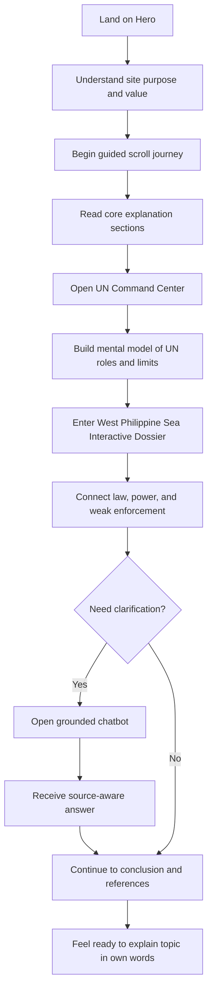
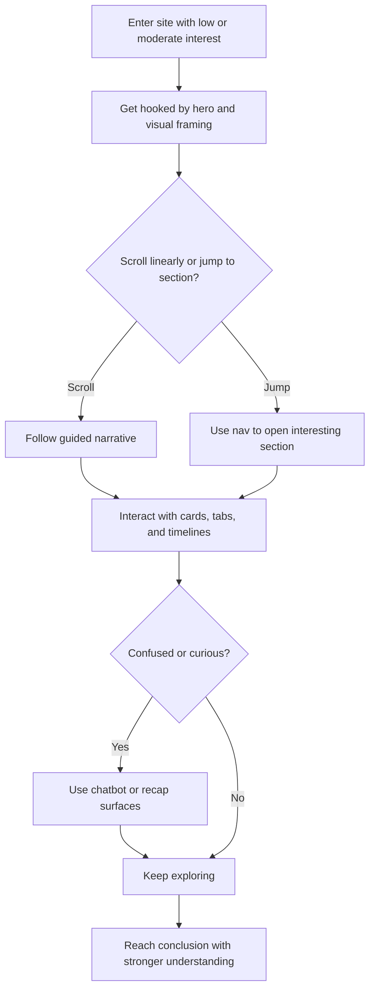
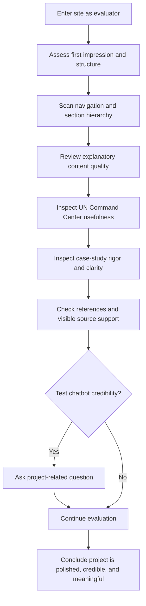

---
stepsCompleted:
  - 1
  - 2
  - 3
  - 4
  - 5
  - 6
  - 7
  - 8
  - 9
  - 10
  - 11
  - 12
  - 13
  - 14
inputDocuments:
  - _bmad-output/planning-artifacts/prd.md
  - archive/docs/planning-artifacts/global_governance_website_prd.md
  - archive/docs/planning-artifacts/global_governance_version_c_feature_pitch.md
  - archive/docs/planning-artifacts/global_governance_version_c_build_roadmap.md
  - archive/docs/planning-artifacts/global_governance_chatbot_architecture_spec.md
  - archive/docs/planning-artifacts/global_governance_coding_agent_guide.md
lastStep: 14
workflow: 'edit'
lastEdited: 2026-04-23
editHistory:
  - date: 2026-04-23
    changes: Aligned motion guidance with the PRD so Motion remains the default interaction model, Lenis handles scroll feel, and GSAP stays limited to rare showcase scenes with reduced-motion priority.
  - date: 2026-04-23
    changes: Removed duplicate core-experience narrative, standardized Global Governance naming, added PRD traceability, and replaced the design-direction summary with an auditable comparison matrix.
  - date: 2026-05-02
    changes: Clarified that the public learner experience remains login-free while any private maintainer or source-stewardship tooling stays outside the public UX flow.
---

# UX Design Specification: Global Governance

**Author:** Nakko
**Date:** 2026-04-23

---

<!-- UX design content will be appended sequentially through collaborative workflow steps -->

## Executive Summary

### Project Vision

Global Governance is a premium single-page educational experience designed to make a dense academic topic feel understandable, memorable, and presentation-ready. The UX should feel like an interactive academic documentary: visually strong enough to stand out in a classroom setting, but disciplined enough that every interaction improves comprehension rather than distracting from it.

### Target Users

The primary user is the student presenter who needs to understand Global Governance clearly and explain it confidently during a live demo or class presentation. Secondary users are classmates who want a faster, more engaging way to grasp the topic, and professors or evaluators who need evidence of academic rigor, source discipline, and thoughtful design execution.

### Key Design Challenges

The first UX challenge is translating abstract political and institutional concepts into a narrative users can quickly understand and retell. The second is balancing premium motion, interactivity, and selective 3D with readability, accessibility, and demo reliability. The third is making the chatbot feel clearly bounded, trustworthy, and academically grounded rather than like a generic AI feature.

### Design Opportunities

The project has a strong opportunity to turn a conventional school report into a cinematic learning experience that improves understanding through structure and interaction. It can create memorable flagship moments through the UN Command Center and West Philippine Sea Interactive Dossier while still keeping the learning flow coherent. It also has an opportunity to build presentation confidence by using strong visual hierarchy, guided pacing, and visible source credibility throughout the experience.

## Core Experience Overview

The core experience is a guided explanatory journey through a complex topic. Users should move through a coherent narrative, understand each major concept in sequence, and come away feeling able to explain the system in their own words. The experience should be optimized first for classroom and demo settings on laptop or projector screens, while remaining fully usable on phones and tablets.

### Key Experience Outcomes

- Users quickly understand that the site is an interactive learning journey.
- Users can move through the narrative without losing orientation.
- Users can inspect the UN module, the case study, and chatbot support as needed.
- Users leave ready to explain the topic in their own words.

The more detailed interaction, component, and accessibility guidance appears later in the document.

## Desired Emotional Response

### Primary Emotional Goals

The primary emotional goal of Global Governance is to make users feel confident, oriented, and intellectually engaged while moving through a complex academic topic. The experience should replace intimidation with clarity and turn passive reading into a feeling of growing understanding. A strong secondary goal is trust: users should feel that the product is academically grounded, carefully designed, and safe to rely on in a presentation setting.

### Emotional Journey Mapping

On first contact, users should feel intrigued and impressed, with the immediate sense that this is more than a static school report. As they move through the core learning flow, that first impression should turn into clarity, momentum, and curiosity rather than overload. By the time they reach the UN Command Center and West Philippine Sea Interactive Dossier, they should feel increasing mastery as difficult concepts become concrete. After completing the experience, the intended emotional outcome is confidence: users should feel ready to explain the topic in their own words. If something goes wrong or feels unclear, the product should create reassurance rather than anxiety by helping users recover quickly and continue without losing trust.

### Micro-Emotions

The most important micro-emotions for this product are confidence over confusion, trust over skepticism, curiosity over disengagement, and accomplishment over frustration. A smaller but still important emotional layer is a sense of seriousness and relevance, especially in the case-study and source-supported parts of the experience. The product should also create moments of satisfaction when users realize they understand a concept that previously felt abstract or difficult.

### Design Implications

To support confidence, the UX should emphasize strong hierarchy, clear sequencing, section orientation, and digestible information layers. To support trust, the experience should make source credibility visible, keep chatbot behavior clearly bounded, and avoid interactions that feel unpredictable or misleading. To support curiosity and engagement, the design should use premium visuals, motion, and interactive modules as narrative accelerators rather than decoration. To support reassurance, the interface should provide readable fallback states, clear navigation recovery, and stable behavior during presentation-critical moments.

### Emotional Design Principles

- Replace intimidation with guided understanding.
- Use visual impact to invite engagement, not to create confusion.
- Build trust through clarity, source visibility, and reliable behavior.
- Reward progress with moments of insight and explanation readiness.
- Keep the emotional tone serious, cinematic, and academically credible.

## UX Pattern Analysis & Inspiration

### Inspiring Products Analysis

The strongest inspiration for Global Governance is Apple-style product storytelling. Its key lesson is how to create a high-impact first impression, control pacing through scroll, and make major sections feel like memorable set pieces without losing narrative clarity. For this project, that pattern is most useful in the hero, transitions into major sections, and the overall sense of guided momentum.

A second strong inspiration is Notion. Its value is not spectacle but information design: calm structure, clean spacing, readable hierarchy, modular content blocks, and progressive disclosure. For Global Governance, this is especially relevant because the product must handle dense academic material without overwhelming the user. The lesson to borrow is how to make complex material feel organized, navigable, and easy to scan.

A third useful inspiration is Perplexity. Its strongest UX pattern is source-aware clarification: suggested prompts, concise answers, visible grounding, and a structure that makes users feel the system is helping rather than improvising. For Global Governance, this is the clearest reference point for the chatbot experience, especially because trust and bounded academic behavior are central to product credibility.

### Transferable UX Patterns

The most transferable pattern is cinematic scrollytelling with strong section pacing, where each major content shift feels intentional and contributes to a coherent learning arc. A second transferable pattern is progressive disclosure: presenting dense information in layers through cards, tabs, timelines, and expandable details rather than forcing users through long uninterrupted text. A third is persistent orientation, using clear section labels, visible navigation, progress cues, and strong heading hierarchy so users always know where they are in the story.

Another important transferable pattern is source-aware assistance. The chatbot should use prompt suggestions, concise answer framing, and visible source support to reduce uncertainty and increase trust. Finally, the interface should combine high-impact moments with calm reading surfaces, so visually rich sections do not compromise legibility or academic seriousness.

### Anti-Patterns to Avoid

The first anti-pattern to avoid is making every section equally intense. If motion, lighting, and interaction are always "on," the experience becomes tiring and loses its ability to highlight important moments. The second anti-pattern is hiding core academic understanding behind novelty interactions that look impressive but slow users down. The third is letting the chatbot feel unbounded or overly general, which would weaken trust and make the academic framing feel less credible.

The product should also avoid dashboard-like fragmentation, where the topic is broken into too many disconnected panels that weaken the documentary flow. It should avoid dense, poorly chunked text blocks that recreate the same friction as a conventional report. Most importantly, it should avoid any visual or interaction choice that makes the site feel like a technical demo instead of a learning experience.

### Design Inspiration Strategy

The design strategy should adopt Apple-style narrative pacing, Notion-like clarity of structure, and Perplexity-like trust cues for clarification and sourcing. These patterns should be adapted rather than copied: cinematic transitions should support academic storytelling, modular information design should support explainability, and chatbot trust mechanics should reinforce bounded, source-aware learning.

The product should use high-impact visual moments selectively in the hero, UN Command Center, and West Philippine Sea Interactive Dossier, while keeping surrounding sections calmer and more readable. It should favor layered explanation, visible source credibility, and strong section orientation throughout. The overall goal is to create a site that feels premium and memorable without sacrificing seriousness, usability, or presentation reliability.

## Design System Foundation

### Design System Choice

Global Governance should use a themeable design system with a custom premium presentation layer. The practical foundation is Tailwind CSS for layout and design tokens, shadcn/ui for accessible interface primitives, and custom-built section components for the hero, scrollytelling flow, UN Command Center, West Philippine Sea Interactive Dossier, and chatbot presentation surfaces. This approach provides a strong balance between implementation speed, accessibility, maintainability, and visual uniqueness.

### Rationale for Selection

A fully custom design system would provide maximum uniqueness, but it would increase design and implementation overhead in a project that already has ambitious interaction, motion, and content demands. A rigid established system such as Material Design or Ant Design would speed development, but it would make the experience feel too generic for a premium academic showcase.

A themeable foundation is the best fit because the project needs both reliability and distinctiveness. It supports rapid development of standard interaction patterns such as tabs, sheets, accordions, dialogs, buttons, and cards, while still allowing the most important sections to feel custom and memorable. It also aligns well with the existing project direction, technical stack, and the need for accessible, presentation-safe UI behavior.

### Implementation Approach

The implementation should separate foundational UI from showcase UI. Foundational interaction components such as navigation, mobile menus, buttons, sheets, tabs, accordions, dialogs, and form-like chat controls should be built from shadcn/ui primitives and styled through project-specific tokens. Showcase sections such as the hero, the major scrollytelling transitions, the UN Command Center, and the West Philippine Sea Interactive Dossier should be built as custom components on top of that foundation.

The system should define reusable tokens for color, typography, spacing, radius, border treatment, elevation, motion timing, and section rhythm. These tokens should drive consistency across the entire site so that even custom sections still feel like part of one coherent design language.

The motion system should follow the same governance as the PRD: Motion should handle repeated component-level animation, Lenis should handle scroll feel, and GSAP should stay reserved for rare showcase scenes that need advanced choreography or pinning. Those showcase scenes should remain isolated so they never delay the opening experience or become the default interaction pattern.

### Customization Strategy

The visual identity should be customized through a diplomacy-oriented premium design language rather than default component-library styling. This means defining a distinctive palette, strong editorial typography hierarchy, layered panel treatments, controlled glow or depth accents, and a motion system that feels cinematic but disciplined.

Customization should happen at three levels. First, global design tokens should establish the shared visual rules. Second, reusable wrappers and UI patterns should express those rules consistently across headings, cards, dividers, and content containers. Third, flagship sections should receive selective custom treatment so they become memorable moments without breaking overall system coherence.

The goal is not to make every component look unique. The goal is to make the entire product feel intentional, consistent, and premium while preserving accessibility, responsiveness, and development efficiency.

## Detailed Core User Experience

### Defining Experience

The defining experience of Global Governance is guided sense-making through a complex topic. The user does not simply read a report. They move through a cinematic but structured narrative, inspect interactive layers when they need detail, use the chatbot when they need clarification, and gradually build an explanation they can confidently say out loud. If this experience works well, the product feels smarter and more useful than a static academic site because it actively helps users understand and articulate the topic.

### User Mental Model

Users currently solve this problem through reports, slides, lecture notes, and scattered online explanations. Their default expectation is that Global Governance will be dense, abstract, and hard to remember. They are likely to approach the site hoping it will make the topic easier, but they may also expect educational content to become text-heavy or confusing.

Because of that, users bring a simple mental model: they want the site to guide them, show them what matters, and help them connect institutions, ideas, and real-world consequences without making them work too hard to understand the structure. They are most likely to get confused when concepts are introduced without enough hierarchy, when interactions hide important information, or when the chatbot feels unreliable or too general.

### Success Criteria

The core experience succeeds when users can move through the story without feeling lost, understand what each major section contributes, and quickly extract the main idea from interactive modules. The product should make users feel smart when they open a module, inspect a concept, and immediately understand how it fits into the bigger picture.

Success is visible when the user can explain the role of the UN, describe the weakness of enforcement, and connect the West Philippine Sea case to the broader argument of the site. It should also feel fast and intuitive: navigation should be immediate, interactive reveals should reduce rather than add friction, and clarification through the chatbot should feel supportive, grounded, and trustworthy.

### Novel UX Patterns

The product should mostly rely on established UX patterns that users already understand, including scrolling, anchored section navigation, tabs, layered cards, timelines, and a side-panel or floating chatbot. This is important because the site already introduces complex ideas, so the interaction model should not create unnecessary learning overhead.

The novelty should come from how those familiar patterns are combined. The unique twist is a documentary-style academic flow where scrollytelling, institutional exploration, case-study interpretation, and source-aware AI clarification work together as one learning experience. The product does not need a radically new interface pattern. It needs a strong orchestration of proven patterns in a way that feels premium, coherent, and unusually effective for this topic.

### Experience Mechanics

The experience begins when the user lands on the hero and is invited into the topic through a strong visual frame and clear call to continue. As they scroll, each section introduces a new layer of understanding, with navigation and headings reinforcing where they are in the larger story.

When users need more detail, they interact with structured modules such as tabs, cards, timelines, and expandable panels. The system responds by revealing focused information rather than dumping everything at once. When users still need clarification, the chatbot provides a bounded, source-aware answer that supports the exact learning moment they are in.

The experience completes successfully when the user reaches the end of the narrative with a clearer mental model, stronger recall of the major arguments, and confidence that they can explain the topic. The next action after completion is not just leaving the page. It is using the site as a presentation aid, study companion, or credibility-enhancing reference during demo and review.

## Visual Design Foundation

### Color System

Global Governance should use a cinematic diplomatic palette built around deep navy, parchment neutrals, muted gold, and restrained strategic accents. The foundation should feel serious, premium, and globally oriented rather than corporate or playful. The site should not rely on a single flat dark surface. Instead, it should alternate between darker atmospheric sections for high-impact moments and lighter reading surfaces for content-heavy explanation.

Recommended color roles:
- Background / atmospheric base: deep navy and blue-black tones
- Reading surfaces: warm ivory, parchment, and muted stone neutrals
- Primary accent: muted gold or brass for authority, emphasis, and section highlights
- Secondary accent: restrained teal for interactive states, navigation feedback, and informative emphasis
- Tension accent: muted red-rust only where conflict, warning, or geopolitical friction must be emphasized

Example token direction:
- `--bg-deep: #0B132B`
- `--bg-elevated: #13203F`
- `--surface-light: #F4EFE6`
- `--surface-muted: #E6E0D4`
- `--text-strong: #F7F4EE` on dark surfaces or `#111827` on light surfaces
- `--text-muted: #AAB4C5` on dark surfaces or `#5B6472` on light surfaces
- `--accent-primary: #C9A86A`
- `--accent-secondary: #4F9C98`
- `--accent-tension: #A94F44`

This system should map semantically rather than decoratively. Gold should mean significance and emphasis, teal should mean active guidance or supportive interaction, and tension accents should be used sparingly so they retain meaning.

### Typography System

The typography should combine editorial gravitas with strong readability. Headlines should feel intelligent, cinematic, and memorable, while body text should remain highly legible across long-form educational sections. The recommended pairing is a serif display face for major headings and a clean humanist or technical sans-serif for body copy, navigation, and UI labels.

Recommended type strategy:
- Display / hero / section titles: `Cormorant Garamond` or `Bodoni Moda`
- Body / interface / cards / navigation: `IBM Plex Sans` or `Source Sans 3`
- Optional mono for references, metadata, or citation chips: `IBM Plex Mono`

Recommended hierarchy:
- Hero headline: 56-72 px desktop, 40-48 px tablet, 32-40 px mobile
- Section titles: 36-48 px desktop, 28-36 px tablet, 24-30 px mobile
- Subsection headings: 24-30 px desktop, 20-24 px mobile
- Body text: 18 px desktop, 16-17 px mobile
- Caption / metadata / citations: 13-14 px

Line heights should favor readability:
- Headlines: 1.05-1.15
- Section headings: 1.15-1.2
- Body copy: 1.6-1.75

The core typographic goal is to make the site feel like a premium academic publication rather than a startup landing page or generic app interface.

### Spacing & Layout Foundation

The layout should feel spacious, rhythmic, and presentation-ready. This is a content-rich product, so spacing must create breathing room and help users process the topic in chapters rather than as one continuous wall of information. The system should use an 8 px base spacing unit with large section intervals and clear inner padding on all reading surfaces.

Recommended layout system:
- Base spacing unit: 8 px
- Desktop grid: 12 columns
- Tablet grid: 8 columns
- Mobile grid: 4 columns
- Standard content max width: 1200-1280 px
- Comfortable reading width for dense text blocks: 60-72 characters
- Section vertical rhythm: 96-160 px desktop, 72-112 px tablet, 56-80 px mobile
- Card padding: 20-32 px depending on density and importance

Layout principles:
- Use wide cinematic framing for the hero and section transitions
- Use narrower reading widths for explanatory content
- Alternate high-impact visual beats with calmer reading beats
- Keep navigation, progress cues, and section anchors visually stable
- Allow flagship modules to break the standard rhythm slightly, but never at the cost of orientation

### Accessibility Considerations

The visual foundation should support WCAG 2.1 AA-oriented readability and interaction. Text contrast should remain strong on both dark and light surfaces, and long-form content should prioritize clarity over atmosphere when conflicts arise. Body text should not fall below 16 px, and the preferred desktop reading size is 18 px for core explanatory content.

Interactive states should be communicated through more than color alone. Focus treatment should be highly visible, hover and active states should be clear, and meaning should not depend on accent color by itself. Motion-heavy sections should preserve readable text contrast and support reduced-motion behavior without collapsing the structure of the page.

The visual system should also ensure that premium styling does not interfere with comprehension. Decorative glow, blur, gradient overlays, or layered textures should never reduce legibility, obscure content hierarchy, or weaken presentation reliability.

## Design Direction Decision

### Design Directions Explored

Six design directions were explored for Global Governance. Diplomatic Editorial tested the strongest full-site balance of premium presentation and academic clarity. Strategic Atlas explored a more analytical systems-driven structure with stronger map and network cues. Documentary Cinema pushed a more dramatic, chapter-based storytelling style for emotional impact. Institutional Ledger explored a lighter archival and publication-oriented direction for source-heavy content. Casefile Immersion focused on an investigative, evidence-led style for the West Philippine Sea module. Command Narrative explored a systems-oriented interactive language for the UN Command Center and other structured explorable modules.

| Direction | Clarity | Trust | Motion load | Implementation cost | Role in final system |
| --- | --- | --- | --- | --- | --- |
| Diplomatic Editorial | High | High | Moderate | Moderate | Chosen full-site default |
| Strategic Atlas | High | High | Low | Low to moderate | Navigation, hierarchy, relationship cues |
| Documentary Cinema | Medium to high | Medium | High | High | Hero and major chapter transitions only |
| Institutional Ledger | High | High | Low | Low | References and reading surfaces |
| Casefile Immersion | High | High | Moderate | Moderate | West Philippine Sea module |
| Command Narrative | High | High | Moderate | Moderate | UN Command Center module |

The matrix shows why one stable full-site language with targeted sub-languages is the best fit for this project.

### Chosen Direction

The recommended direction is a hybrid system anchored by Diplomatic Editorial as the primary full-site design language. This direction provides the strongest balance of cinematic presence, readability, academic seriousness, and presentation confidence. It should be combined with Strategic Atlas principles for navigation clarity and systems-oriented layout logic, Casefile Immersion styling for the West Philippine Sea Interactive Dossier, and Command Narrative interaction patterns for the UN Command Center.

Documentary Cinema should influence selected moments such as the hero and major chapter transitions, but not dominate the entire site. Institutional Ledger should inform the treatment of references, citations, and longer reading surfaces. The final design direction is therefore not a single isolated mockup, but a controlled composition built around one core language and a few carefully scoped accents.

### Design Rationale

This hybrid direction works because it preserves coherence across the entire product while allowing the most important sections to feel distinct and memorable. Diplomatic Editorial is the strongest baseline because it aligns with the product's emotional goals: confidence, trust, curiosity, and seriousness. It also supports the intended classroom-demo context better than more extreme directions.

Borrowing from Strategic Atlas improves orientation and helps users understand institutions, actors, and relationships more quickly. Borrowing from Casefile Immersion strengthens the real-world case study by giving it a more investigative and evidence-driven tone. Borrowing from Command Narrative makes the UN module feel more interactive and structurally clear. This combination supports both academic credibility and premium presentation without making the site feel fragmented or overdesigned.

### Implementation Approach

The implementation should establish Diplomatic Editorial as the default system through shared tokens for color, typography, spacing, and surface treatments. Core layout, section transitions, navigation, and standard content modules should all follow this main visual language. Strategic Atlas logic should shape information hierarchy, directional cues, and relationship-oriented section structures.

Module-specific accents should then be layered selectively. The West Philippine Sea Interactive Dossier should adopt a casefile-style sub-language with evidence framing, timeline emphasis, and stronger tension cues. The UN Command Center should use a command-style interaction model with tabs, structured panels, and comparison-oriented layouts. Hero transitions and selected chapter breaks may adopt more cinematic pacing and contrast, but these moments should remain controlled so the full experience stays readable, stable, and coherent.

## Scope Boundaries

### MVP

The MVP should ship with a simplified hero narrative frame, guided scrollytelling, the UN Command Center, the West Philippine Sea Interactive Dossier, source-aware chatbot support as a flagship premium clarification surface, recap moments, references, and responsive accessibility. The opening hero should establish identity and momentum without requiring the full Living Globe implementation or any live Student / Expert mode switch. The public learner experience should remain login-free, and any maintainer-only stewardship tooling should stay outside this primary UX path.

### Post-MVP

The post-MVP layer should introduce the full Living Globe Hero, Student / Expert mode, deeper chatbot source interaction, answer-depth variation, optional continuity beyond the MVP session-local history model, and additional presentation polish. These are expansion features, not launch blockers for the initial experience.

### Naming Conventions

- Use `West Philippine Sea Interactive Dossier` as the public-facing name for the case-study module.
- Use `casefile-style timeline layout` as the internal layout descriptor when needed.
- Keep `UN Command Center` and `Source-Aware Chat Panel` as the canonical names for those modules.

## Requirements Traceability

| PRD Area | UX Coverage | Primary Sections / Components | Notes |
| --- | --- | --- | --- |
| FR1-FR7 core learning flow | Executive Summary, Core Experience Overview, Detailed Core User Experience, Information Architecture | Hero Narrative Frame, Chapter Transition Block, Insight Recap Card | Covers the end-to-end educational flow and no-account experience. |
| FR8-FR12 navigation | Information Architecture & Narrative Order, Navigation Patterns, Section Progress Rail | Top navigation, progress rail, return-to-top, stable jump targets | Keeps orientation intact across a long single-page experience. |
| FR13-FR17 interactive modules | Component Strategy, Journey Flows | UN Organ Explorer, West Philippine Sea Interactive Dossier | Supports layered institutional exploration and case-study learning. |
| FR18-FR22 comprehension support | Core Experience Overview, Detailed Core User Experience, UX Consistency Patterns | Insight Recap Card, progressive disclosure, chapter transitions | Reinforces understanding and easy re-entry. |
| FR23-FR29 chatbot assistance | Component Strategy, Form Patterns, UX Consistency Patterns | Source-Aware Chat Panel, prompt suggestions, fallback states | Keeps responses bounded and source-aware. |
| FR30-FR34 source credibility | Component Strategy, UX Consistency Patterns | Reference Evidence Drawer, source chips, citation metadata | Makes academic grounding visible. |
| FR35-FR41 maintainer workflows | Scope Boundaries, Testing Strategy, Design System Foundation | Source stewardship, validation workflow support, local workflow support | Keeps the UX spec aligned with maintainability. |
| FR42-FR46 presentation and expansion | Scope Boundaries, Design Direction Decision | Living Globe Hero, Student / Expert mode, simulator future states | Preserves a clean MVP while leaving room to grow. |
| NFR1-NFR5 performance | Visual Design Foundation, Responsive Design & Accessibility, Testing Strategy | Motion governance, lazy loading, fallback behavior | Protects demo speed and interaction smoothness. |
| NFR6-NFR11 privacy and security | Executive Summary, Form Patterns, Scope Boundaries | No account surface, minimal data entry, source stewardship | The UX avoids unnecessary personal-data collection. |
| NFR12-NFR15 reliability | Scope Boundaries, UX Consistency Patterns, Testing Strategy | Fallback states, recoverable errors, demo validation | Keeps the core learning flow usable under partial failure. |
| NFR16-NFR20 accessibility | Visual Design Foundation, Responsive Design & Accessibility | Semantics, focus states, reduced motion, touch targets | Sets the accessibility baseline. |
| NFR21-NFR24 integration resilience | Scope Boundaries, Testing Strategy, Component Strategy | Source-aware workflow support, smoke-testable UI states | Supports local validation and future expansion.

## User Journey Flows

### Student Presenter Preparation and Demo Flow

This is the primary journey. The user arrives needing to understand the topic well enough to explain it clearly in class. The flow should get them into the narrative quickly, keep them oriented, let them inspect key modules at the right depth, and give them trusted clarification when needed.

Success in this journey means the user can retell the core argument, use the site as a presentation aid, and recover quickly if they forget a detail during practice or live demo.

### Classmate Learner Exploration Flow

This journey is less presentation-driven and more curiosity-driven. The user may skim, jump, and explore nonlinearly, so the flow must support selective learning without losing coherence.

Success here means the user can understand the topic faster than they could from a report and never feels punished for entering the experience out of order.

### Professor or Evaluator Review Flow

This journey focuses on credibility, completeness, and polish. The evaluator is checking whether the project is academically serious and whether the interactivity genuinely improves understanding.

Success in this journey means the evaluator can immediately see that the experience is not decorative work hiding weak substance, but a well-structured academic product with disciplined sourcing and thoughtful UX.

### Journey Patterns

Common patterns should be standardized across all flows. Users should always have clear section orientation, visible progress through the narrative, and predictable ways to reveal more detail without losing context. Interactive modules should favor layered disclosure over information dumping. Recovery patterns should also be consistent: if users feel lost, they should be able to re-anchor through navigation, recap content, section labels, or chatbot clarification.

### Flow Optimization Principles

The first principle is to minimize time to understanding, not just time to interaction. The second is to maintain orientation at every point in the experience, especially for non-linear exploration. The third is to make clarification lightweight and trustworthy through source-aware support. The fourth is to ensure that flagship modules deepen comprehension instead of interrupting it. The fifth is to preserve presentation confidence by making every critical flow stable, readable, and easy to resume.

## Information Architecture & Narrative Order

### Canonical Section Sequence

| Order | Section | Primary Purpose | Exit State |
| --- | --- | --- | --- |
| 1 | Hero Narrative Frame | Establish the topic, tone, and reason to continue | User chooses to enter the learning flow |
| 2 | Global governance overview | Define global governance and why it matters | User can summarize the core thesis |
| 3 | UN Command Center | Explain institutions, roles, powers, and limits | User can describe what the UN can and cannot do |
| 4 | Governance limits and enforcement | Show enforcement gaps, criticism, and power imbalance | User understands the gap between law and enforcement |
| 5 | West Philippine Sea Interactive Dossier | Ground the topic in a concrete case study | User can connect law, politics, and real-world response |
| 6 | Conclusion and references | Consolidate the thesis and visible evidence | User leaves with a presentation-ready takeaway |

The chatbot remains available throughout the full sequence, and the ending state should always include a clear conclusion plus access to references rather than a dead-end screen.

## Component Strategy

### Design System Components

The design system foundation should come from shadcn/ui primitives styled through the project's custom tokens and visual language. These components cover most standard interaction needs and should be reused instead of rebuilt.

Recommended foundation components include:
- Button
- Card
- Tabs
- Accordion
- Sheet
- Dialog
- Tooltip
- Separator
- Scroll Area
- Badge
- Collapsible
- Input and textarea primitives for chatbot interaction
- Command-style searchable list patterns where useful for structured exploration

These components should handle navigation controls, mobile menus, content grouping, progressive disclosure, chatbot input, secondary overlays, and other standard interface behaviors. Their role is to provide consistency, accessibility, and implementation speed.

The gap is not in basic UI primitives. The gap is in the experience-defining components: the cinematic hero, chapter transitions, section orientation, institutional exploration, case-study storytelling, and source-aware educational support. Those pieces should be custom-built.

### Custom Components

### Hero Narrative Frame

**Purpose:** Establish the topic, tone, and first major call to continue into the learning journey.  
**Usage:** Used only at the top of the experience.  
**Anatomy:** Eyebrow label, primary headline, supporting paragraph, CTA, atmospheric visual layer, future Living Globe layer, future mode toggle hook.
**States:** Default, motion-enabled, reduced-motion fallback, loading-safe fallback for heavier visuals.  
**Variants:** MVP simplified cinematic version and post-MVP Living Globe version.
**Accessibility:** Clear heading structure, keyboard-reachable CTA, reduced-motion support, decorative visuals hidden from screen readers.  
**Interaction Behavior:** Encourages entry into the story without demanding complex input. The MVP hero should not depend on a live mode switch; that belongs to the post-MVP Student / Expert expansion.

### Section Progress Rail

**Purpose:** Keep users oriented throughout the long single-page experience.  
**Usage:** Persistent desktop element and simplified mobile equivalent.  
**Anatomy:** Section markers, active state, progress indicator, current chapter label, optional return-to-top action.  
**States:** Default, active section, completed section, compact mobile state.  
**Variants:** Full rail for desktop, condensed progress chip or menu state for smaller screens.  
**Accessibility:** Keyboard reachable, clear labels for section names, visible focus states, current location exposed semantically.  
**Interaction Behavior:** Allows quick re-entry into any major chapter without losing context.

### Chapter Transition Block

**Purpose:** Separate major conceptual chapters and create rhythm between dense sections.  
**Usage:** Between major story beats such as introduction, institutions, governance limits, and case study.  
**Anatomy:** Transition heading, short bridge copy, optional visual divider or atmospheric motif.  
**States:** Static, motion-enhanced, reduced-motion fallback.  
**Variants:** Light-surface and dark-atmosphere versions.  
**Accessibility:** Must preserve heading hierarchy and avoid motion that blocks reading.  
**Interaction Behavior:** Signals a shift in topic and resets attention before the next section.

### UN Organ Explorer

**Purpose:** Turn the United Nations section into a structured explorable module.  
**Usage:** Core flagship interaction in the UN Command Center section.  
**Anatomy:** Organ selector, summary panel, role/power/limit indicators, why-it-matters explanation, optional comparison mode.  
**States:** Default selected organ, hover, active, keyboard focus, compact mobile stack, optional comparison state.  
**Variants:** Tabbed layout, stacked-card mobile layout, highlighted featured-organ state.  
**Accessibility:** Fully keyboard navigable, tab semantics or equivalent, clear labels for each organ, no information hidden behind hover alone.  
**Interaction Behavior:** Selecting an organ updates the content panel immediately and helps users compare institutional roles without reading long walls of text.

### West Philippine Sea Interactive Dossier

**Purpose:** Present the West Philippine Sea case as an evidence-led, chronological learning module.  
**Usage:** Core flagship interaction in the West Philippine Sea Interactive Dossier section.  
**Anatomy:** Timeline rail, event cards, legal-context panel, ruling-versus-reality comparison, evidence or source drawer.  
**States:** Default timeline overview, selected event, expanded detail, comparison state, citation-open state.  
**Variants:** Desktop split-panel layout and mobile stacked sequence.  
**Accessibility:** Sequential reading order preserved, timeline controls keyboard operable, comparison content readable without animation dependence.  
**Interaction Behavior:** Users move event by event, see the legal and political context, and understand the escalation from ruling to weak enforcement.

### Source-Aware Chat Panel

**Purpose:** Give users trusted clarification through a premium course-assistant surface without breaking the educational framing.  
**Usage:** Persistent support tool available throughout the experience, including as a presentation-safe re-entry point when users need clarification.  
**Anatomy:** Entry dock or button, premium intro state, trust badges, guided topic cards from server-driven suggestions, message list, grounded answer body, source chips or source drawer, composer, and fallback messaging.  
**States:** Closed, open-intro, threaded conversation, loading, answered, weak-support fallback, off-topic refusal, rate-limited cooldown, and error recovery.  
**Variants:** Floating panel on desktop and bottom-sheet style presentation on mobile, while preserving the same transcript model.  
**Visual Direction:** Use the diplomatic navy, muted gold, and teal palette with atmospheric world-map or institutional texture assets when available, while keeping typography and contrast readable.  
**Accessibility:** Focus management for open/close states, labelled input, accessible source toggles, visible thread ordering, and clear announcement of loading, fallback, and cooldown states.  
**Interaction Behavior:** Users can enter through guided topic cards, ask multiple follow-up questions in one session, keep prior responses visible in a session-local thread, inspect sources inline, and return to the main narrative without losing place. If public-chat protection rules trigger, the panel should explain the cooldown calmly and offer an obvious retry path. Future Student / Expert answer-depth behavior should layer onto this surface only after the core grounded retrieval path is complete, and it must preserve source visibility, typed fallback states, and the premium assistant framing. Any private maintainer dashboard or source-stewardship tooling should remain outside this learner-facing interaction pattern.

### Insight Recap Card

**Purpose:** Reinforce understanding at key checkpoints and help users retain the main point of a section.  
**Usage:** End of major chapters or after dense interactive modules.  
**Anatomy:** Key takeaway heading, 2-3 summary points, optional “what this means” note, optional next-step link.  
**States:** Default, expanded, pinned or highlighted.  
**Variants:** MVP concise version and future Student / Expert extended version if that feature is later enabled.
**Accessibility:** Readable in plain text order and usable without animation.  
**Interaction Behavior:** Gives users a clear mental checkpoint before moving on.

### Reference Evidence Drawer

**Purpose:** Make academic support visible without cluttering the main content flow.  
**Usage:** Attached to references section, chatbot answers, and case-study evidence surfaces.  
**Anatomy:** Source list, citation metadata, excerpt summary, optional section links back into the page.  
**States:** Closed, open, filtered, citation-highlighted.  
**Variants:** Inline expandable version and side drawer version.  
**Accessibility:** Proper button semantics, labelled regions, no source data hidden in hover-only states.  
**Interaction Behavior:** Lets users inspect credibility when they need it, without forcing everyone into citation-heavy reading.

### Component Implementation Strategy

The component strategy should follow a layered model. Standard interaction primitives should come from shadcn/ui and remain visually consistent through shared tokens. Experience-defining components should be built as custom composites that sit on top of those primitives rather than bypassing them completely.

The practical rule should be:
- Use design-system primitives for structure, controls, overlays, and accessibility scaffolding.
- Build custom composites for story flow, institutional exploration, case-study storytelling, and source-aware learning.
- Reuse tokens for spacing, typography, radius, surface treatment, and motion timing across both layers.
- Treat mobile responsiveness and keyboard access as first-class requirements for every custom component.

This keeps the system efficient to build while still allowing the site's strongest sections to feel original and memorable.

### Implementation Roadmap

**Phase 1 - Core Components**  
Build the components required for the main narrative to function:
- Hero Narrative Frame
- Section Progress Rail
- Chapter Transition Block
- Source-Aware Chat Panel shell

**Phase 2 - Flagship Learning Components**  
Build the components that make the site meaningfully better than a report:
- UN Organ Explorer
- West Philippine Sea Interactive Dossier
- Insight Recap Card

**Phase 3 - Credibility and Polish Components**  
Build the components that strengthen trust, clarity, and presentation readiness:
- Reference Evidence Drawer
- richer chatbot source states
- refined comparison and recap variants
- mobile-specific optimized versions of flagship modules

The order should follow user value, not visual excitement. The main story flow and learning clarity should work before the more ambitious presentation layers are fully refined.

## UX Consistency Patterns

### Button Hierarchy

Global Governance should use a clear three-level button hierarchy.

**Primary actions** should be reserved for high-importance forward motion, such as entering the experience, opening a flagship interaction, sending a chatbot question, or moving to the next major learning step. Primary buttons should use the strongest visual emphasis in the system, typically the gold-accent treatment or equivalent high-contrast action style.

**Secondary actions** should support exploration without competing with primary progress. These include actions such as viewing more detail, opening references, switching sections, or revealing structured content layers. Secondary buttons should feel supportive and stable rather than dominant.

**Tertiary actions** should be low-emphasis controls such as inline text actions, dismissals, minor toggles, or supporting utilities. These should remain visible and usable without adding visual clutter.

Pattern rules:
- Only one primary action should dominate a local area at a time.
- Buttons should use action-first labels such as `Explore the UN`, `View Evidence`, or `Ask the Chatbot`.
- Hover, focus, active, and disabled states must be visually distinct.
- Icon use should support meaning, not replace readable text.
- On mobile, button sizing should remain touch-friendly and spacing should prevent accidental taps.

### Feedback Patterns

Feedback should always reduce uncertainty and support trust. The interface should not leave users guessing whether an interaction worked, failed, or is still in progress.

**Success feedback** should be calm and confirming, not celebratory to the point of feeling app-like or playful. Use it for moments such as copied citations, successful section jumps, or a completed chat response with valid source support.

**Informational feedback** should guide users through structured exploration, such as showing that more detail is available, a section has been updated, or a mode has changed.

**Warning feedback** should appear when context is limited, support is weak, or the user may be leaving the narrative path. These states should be reassuring rather than alarming.

**Error feedback** should be plain, recoverable, and specific. If the chatbot cannot answer, or a content panel fails to load, the system should explain what happened and provide the next best action.

**Protection feedback** should feel calm, brief, and non-punitive. If a rate limit or cooldown is triggered, the interface should explain that the chatbot is temporarily protected, show when the user can try again if known, and keep the rest of the learning experience fully usable.

Pattern rules:
- Every feedback state should answer: what happened, what it means, and what the user can do next.
- Feedback should appear close to the triggering interaction.
- Error states should always offer recovery, not just failure.
- Color should support meaning, but not be the only signal.

### Form Patterns

Form behavior in this project is centered mostly on chatbot interaction, prompt entry, and small control patterns rather than large data-entry flows. Because of that, forms should feel lightweight, readable, and low-friction.

The chatbot input should support:
- a clearly labeled text field
- suggested prompts for quick starts
- obvious submit affordance
- visible loading state after submission
- visible cooldown or retry guidance when public-chat protection limits are reached
- preserved context when the panel stays open

Validation should be minimal and humane. Empty submission, unsupported questions, weak-source situations, and temporary cooldown states should all be handled with clear inline guidance rather than abrupt rejection.

Pattern rules:
- Inputs should use generous spacing and readable placeholder or label text.
- Validation should appear inline and immediately explain how to recover.
- Submit actions should remain accessible by keyboard.
- Chat interactions should preserve user input context unless clearing is intentional.
- Mobile chat input should not obscure key surrounding controls.

### Navigation Patterns

Navigation must prioritize orientation across a long single-page experience. Users should always know where they are, what section they are in, and how to move without breaking the narrative.

The navigation system should combine:
- a stable top-level navigation for major sections
- a visible active-section state
- a section progress cue or progress rail
- clear re-entry points after users jump between chapters
- a return-to-top or quick-reset option

Flagship modules should also have internal navigation patterns that feel related to the main system. Tabs, timelines, drawers, and cards should reveal depth without making users feel they have left the main page architecture.

Pattern rules:
- Section names should stay short, clear, and concept-driven.
- Active states must be visible on both desktop and mobile.
- Jump navigation should land users in a stable, readable place with preserved context.
- Internal module navigation should not visually conflict with page-level navigation.
- Users should always have a clear path back to the broader story.

### Additional Patterns

**Loading states** should feel intentional and trustworthy. Skeletons, progress indicators, and chat loading patterns should suggest continuity rather than interruption. Loading feedback should appear quickly and should never leave a blank region unexplained.

**Empty states** should be instructive rather than decorative. If a panel has no selected item, or the chatbot has not been used yet, the interface should show the next useful action, such as selecting an organ, choosing a timeline point, or trying a suggested question.

**Overlay patterns** such as sheets, dialogs, and drawers should be used sparingly and only when they preserve the main narrative instead of derailing it. References, evidence details, and chatbot source views are good candidates. Full-screen interruption should be avoided unless absolutely necessary.

**Progressive disclosure patterns** should be consistent across the site. If one section uses expandable cards, another uses tabs, and another uses drawers, they should still feel like members of the same design family through shared motion timing, typography, spacing, and state treatment.

**Custom pattern rules**
- The page should always feel like one continuous academic experience, even when modules become interactive.
- Trust cues such as references, source chips, and section labels should appear consistently across all major learning moments.
- Motion should clarify structure and change, not compete with content.

## Responsive Design & Accessibility

### Responsive Strategy

Global Governance should use a responsive single-page strategy that preserves narrative clarity across desktop, tablet, and mobile without treating all devices the same. The highest-quality presentation target should be desktop and laptop screens, since the product is most likely to be used in classroom presentation and evaluator-review contexts. On larger screens, the layout should take advantage of width through split panels, persistent orientation cues, richer chapter transitions, and more spacious module layouts.

Tablet layouts should preserve the same story flow while simplifying density and increasing touch comfort. Interactive modules such as the UN Command Center and West Philippine Sea Interactive Dossier should shift from wider multi-panel arrangements into more touch-friendly stacked or hybrid layouts. Mobile layouts should remain fully usable, but should prioritize core reading flow, section orientation, and essential interactions over spectacle. On smaller screens, the experience should collapse into a readable chapter sequence with compact navigation, stacked cards, simplified motion behavior, and bottom-sheet or overlay patterns where needed.

The responsive strategy should therefore be mobile-first in implementation, but desktop-priority in presentation ambition.

### Breakpoint Strategy

The breakpoint strategy should align with the project's most important use cases rather than generic device categories alone. Recommended working breakpoints are:

- Small mobile: `360px+`
- Large mobile / small tablet transition: `480px+`
- Tablet: `768px+`
- Laptop / desktop: `1024px+`
- Large desktop presentation layouts: `1280px+`

At `360px`, the site should preserve readable text, clear section flow, touch-friendly controls, and no horizontal scrolling. At `768px`, the layout should begin introducing more structured grouping and roomier module behavior. At `1024px+`, the full intended presentation layout should appear, including persistent navigation cues, wider chapter framing, and stronger side-by-side content arrangements. At `1280px+`, the layout can use additional space for premium composition, but it should avoid making lines too long or panels too diffuse.

### Accessibility Strategy

The accessibility target should be WCAG 2.1 AA-aligned design and implementation. This is the right standard for the project because the site is educational, content-heavy, interaction-rich, and intended to support understanding rather than only visual impact.

Key accessibility requirements should include:
- semantic heading structure across the full learning flow
- strong text contrast on both dark and light surfaces
- visible keyboard focus for all interactive controls
- keyboard-operable navigation, tabs, drawers, timelines, and chatbot controls
- minimum touch targets of `44x44px`
- reduced-motion support for nonessential animation, parallax, and looping effects
- decorative visual layers hidden from assistive technologies when they do not add meaning
- screen-reader-friendly labels for major actions, landmark regions, and module controls

Because the site includes motion, selective 3D, and layered interaction, accessibility must be treated as a design constraint from the start, not as a final audit step. If a premium effect and a readable accessible experience conflict, the readable option should win.

### Testing Strategy

Responsive testing should include real-device checks and browser testing across Chrome, Edge, Firefox, and Safari, with emphasis on laptop screens, tablet widths, and common phone sizes. Testing should cover hero behavior, section navigation, UN module layout changes, case-study usability, chatbot panel behavior, and reference access across breakpoints.

Accessibility testing should include:
- keyboard-only walkthroughs of the full learning flow
- automated scans using tools such as Axe and Lighthouse
- screen reader spot checks with VoiceOver and NVDA
- reduced-motion testing
- contrast testing for all semantic surfaces and action states
- zoom and text-resize testing
- touch-target verification on smaller screens

The testing strategy should also include low-risk demo validation: slower network simulation, heavier visual sections under load, and fallback behavior when advanced presentation layers are delayed or unavailable.

### Implementation Guidelines

Responsive development should use mobile-first CSS and component logic, with layouts expanding progressively through min-width breakpoints. Relative units such as `rem`, `%`, `vw`, and `clamp()` should be preferred over fixed pixel assumptions. Reading widths should be constrained deliberately, even on large screens, so long-form content remains comfortable.

Accessibility implementation should use semantic HTML first and ARIA only where native semantics are insufficient. Focus order should follow the narrative structure of the page. Skip links, landmark regions, and labelled module boundaries should be included where helpful. No essential information should depend on hover alone, and no critical interaction should require a pointer device.

Heavy visual elements should degrade gracefully. Motion-enhanced sections should always have reduced-motion variants. React Three Fiber or other premium visuals should never block access to core content, navigation, or learning modules. The final implementation should preserve one consistent rule across the entire site: every user must be able to understand, navigate, and complete the learning experience regardless of device size, motion preference, or input method.
